Proteomics-Based Patient Stratification, and Therapeutic Target
Discovery in Pediatric Brain Tumours
================
2026-04-29

- [Overview](#overview)
  - [Data files used from
    `./brain_cptac_2020`](#data-files-used-from-brain_cptac_2020)
  - [Risk](#risk)
  - [Pipeline summary](#pipeline-summary)
- [1. Packages & Configuration](#1-packages--configuration)
- [2. Data Loading](#2-data-loading)
- [3. Quality Control](#3-quality-control)
- [4. Exploratory Analysis](#4-exploratory-analysis)
  - [4.1 PCA](#41-pca)
  - [4.2 PLS-DA (supervised projection by
    histology)](#42-pls-da-supervised-projection-by-histology)
  - [4.3 Sparse PLS-DA (feature selection by
    histology)](#43-sparse-pls-da-feature-selection-by-histology)
  - [4.4 UMAP (non-linear sanity
    check)](#44-umap-non-linear-sanity-check)
- [5. Dimensionality Reduction (PCA to NMF
  input)](#5-dimensionality-reduction-pca-to-nmf-input)
- [6. Selecting the Number of Clusters
  (k)](#6-selecting-the-number-of-clusters-k)
- [7. Consensus NMF Clustering](#7-consensus-nmf-clustering)
- [8. Cluster Annotation](#8-cluster-annotation)
- [9. Histological Composition per
  Cluster](#9-histological-composition-per-cluster)
- [10. Survival Analysis
  (Kaplan–Meier)](#10-survival-analysis-kaplanmeier)
- [11. Cox Proportional Hazards
  Model](#11-cox-proportional-hazards-model)
- [12. Differential Protein Expression (limma
  one-vs-rest)](#12-differential-protein-expression-limma-one-vs-rest)
- [13. Random Forest (classification by
  histology)](#13-random-forest-classification-by-histology)
- [14. Therapeutic Target Discovery](#14-therapeutic-target-discovery)
  - [14.1 Per-cluster phosphosite contrasts
    (limma)](#141-per-cluster-phosphosite-contrasts-limma)
  - [14.2 Kinase activity per cluster
    (KSEA)](#142-kinase-activity-per-cluster-ksea)
  - [14.3 Cluster-marker shortlist (overexpressed
    proteins)](#143-cluster-marker-shortlist-overexpressed-proteins)
  - [14.4 DepMap brain-line
    dependency](#144-depmap-brain-line-dependency)
  - [14.5 Druggability annotation
    (OpenTargets)](#145-druggability-annotation-opentargets)
  - [14.6 Integrated per-cluster therapeutic
    panel](#146-integrated-per-cluster-therapeutic-panel)
- [15. Molecular Surrogate
  Classifier](#15-molecular-surrogate-classifier)
  - [15.1 Define classification
    targets](#151-define-classification-targets)
  - [15.2 Cross-validated logistic-lasso classifier per
    target](#152-cross-validated-logistic-lasso-classifier-per-target)
  - [15.3 ROC curves with held-out
    predictions](#153-roc-curves-with-held-out-predictions)
  - [15.4 Selected proteins per
    target](#154-selected-proteins-per-target)
  - [15.5 Limitations](#155-limitations)
- [References](#references)

------------------------------------------------------------------------

## Overview

This notebook reproduces and extends the proteomics-based patient
stratification from Petralia et al. (Cell, 2020) using the publicly
available CPTAC/CHOP pediatric brain cancer dataset (`brain_cptac_2020`
on cBioPortal). Building on the unsupervised NMF subtypes, it asks two
complementary precision-oncology questions:

1.  **Therapeutic target discovery (§14).** For each proteomic subtype,
    can we propose a panel of candidate drug targets supported by
    multiple, independent lines of evidence, cluster-specific
    overexpression (limma), inferred kinase activity (KSEA on the
    phosphoproteome), brain-cancer cell-line dependency (DepMap CRISPR
    essentiality), and approved-drug coverage (OpenTargets / DGIdb)?
2.  **Molecular surrogate classification (§15).** Can the proteome serve
    as a surrogate predictor of clinically actionable molecular markers
    (WHO grade, IDH/H3F3A driver status) that today require sequencing?
    With ≈ 100+ patients per outcome class this is the only branch where
    a properly held-out predictive claim is statistically credible in
    this cohort.

**Dataset:** 218 tumour samples from 199 patients across 7 histological
subtypes (LGG, Ependymoma, HGG, Medulloblastoma, Ganglioglioma,
Craniopharyngioma, ATRT), each with WGS, RNA-seq, global proteomics, and
phosphoproteomics.

### Data files used from `./brain_cptac_2020`

| File | Used for |
|----|----|
| `data_clinical_patient.txt` | Demographics, OS (`os_status`, `os_months`), DFS (`dfs_status`, `dfs_months`), WHO grade, age at diagnosis, sex, and pre-computed driver-mutation flags (`braf_status`, `h3f3a_ctnnb1_status`, `ependymoma_rela_status`, `hgg_h3f3a_status`, `lgg_braf_status`, `ctnnb1_status`) |
| `data_clinical_sample.txt` | Sample-level metadata: `cancer_type_detailed`, `tumor_type`, treatment fields (`extent_of_tumor_resection`, `radiation`, `chemotherapy`), tissue site |
| `data_protein_quantification.txt` | Global proteomics matrix: feature space for clustering, differential expression, and the molecular-subtype classifier (§15) |
| `data_phosphoprotein_quantification.txt` | Phosphosite-level abundances: feeds per-cluster kinase-activity inference (KSEA) in §14 |

### Risk

1.  **Prognostic risk**: the descriptive question *“do these proteomic
    subtypes have different survival outcomes?”*, addressed in §10–11
    with KM curves and a Cox model on cluster + extended clinical
    baseline. Because the clusters were defined unsupervised on the
    proteome (no survival input), this section is honest and free from
    outcome leakage. With only ≈ 36 OS events across 218 patients,
    however, this cohort is too small to support a credible per-patient
    predictive risk score (the rule of thumb is ≥ 10 events per
    parameter), so we deliberately do not attempt one.
2.  **Therapeutic risk and opportunity**: the precision-oncology
    question *“what targets is each subtype most likely to depend on,
    and which of those are druggable?”*, addressed in §14, where each
    cluster is characterised by overexpressed proteins, inferred kinase
    activity from phosphoproteomics, brain cell-line dependency
    profiles, and approved-drug coverage. The deliverable is a
    per-cluster panel of candidate targets, not a per-patient score.

The §15 classifier sidesteps the OS-event-count problem entirely by
predicting molecular outcomes (WHO grade and driver status) where the
cohort has 100+ events per class, allowing a properly cross-validated
predictive claim.

### Pipeline summary

    Local data files
        │ load + clean column names
        v
    Quality control
        │ remove high-missing proteins, KNN imputation
        v
    Exploratory analysis
        │ PCA, PLS-DA, sPLS-DA, UMAP
        v
    Dimensionality reduction
        │ top 25 PCs, shift to non-negative for NMF
        v
    k selection
        │ cophenetic / dispersion / silhouette across k = K_MIN..K_MAX
        v
    Consensus NMF clustering
        │ N runs at chosen k, consensus matrix, final cluster labels
        v
    Biological characterisation
        ├── Histological composition per cluster
        ├── Kaplan–Meier survival (log-rank test)
        ├── Cox model, extended clinical baseline + cluster
        ├── Differential protein expression (limma one-vs-rest)
        └── Variable importance (RF)
        v
    Therapeutic target discovery (§14)
        ├── Phospho one-vs-rest contrasts per cluster
        ├── Kinase activity inference (KSEA, OmniPath substrates)
        ├── DepMap brain-line dependency for cluster markers
        ├── Druggability annotation (OpenTargets / DGIdb)
        └── Integrated per-cluster therapeutic panel
        v
    Molecular surrogate classifier (§15)
        └── Proteomic predictor of WHO grade and driver status
            with held-out cross-validation (honest predictive claim)

------------------------------------------------------------------------

## 1. Packages & Configuration

All libraries are loaded up front so that every chunk runs in a known
environment.

``` r
# Core
library(tidyverse) # dplyr, ggplot2, tidyr, purrr, stringr
library(janitor) # clean_names() for consistent column naming
library(car) # model performance metrics (VIF, etc.)
library(gridExtra) # arrange ggplot output

# Matrix / imputation
library(impute) # KNN imputation for missing proteomics values (Bioconductor)

# Clustering
library(NMF) # Non-negative matrix factorisation + consensus clustering
library(cluster) # silhouette scores
library(pheatmap) # annotated heatmaps
library(RColorBrewer) # colour palettes
library(ConsensusClusterPlus) # alternative consensus clustering for sanity check

# Exploratory / supervised projection
library(mixOmics) # PLS-DA, sPLS-DA
library(umap) # non-linear projection

# Survival (descriptive only in §10–11; no predictive risk score in this version)
library(survival) # Surv(), survfit(), coxph()
library(survminer) # ggsurvplot()

# Differential expression
library(limma) # linear models for proteomics; well-validated on MS data

# Variable importance (descriptive ranking only)
library(randomForest) # classification importance
library(randomForestSRC) # random survival forests

# §15 molecular-surrogate classifier
library(glmnet) # logistic / multinomial cv.glmnet for the classifier

# Optional packages — chunks degrade if missing
have_OmnipathR <- requireNamespace("OmnipathR", quietly = TRUE) # KSEA substrates
have_depmap <- requireNamespace("depmap", quietly = TRUE) # DepMap CRISPR essentiality
have_httr2 <- requireNamespace("httr2", quietly = TRUE) # OpenTargets druggability
have_jsonlite <- requireNamespace("jsonlite", quietly = TRUE) # OpenTargets JSON parse
have_GSVA <- requireNamespace("GSVA", quietly = TRUE) # optional pathway-enrichment per cluster
have_msigdbr <- requireNamespace("msigdbr", quietly = TRUE) # hallmark gene sets
if (have_OmnipathR) library(OmnipathR)
if (have_depmap) library(depmap)
if (have_httr2) library(httr2)
if (have_jsonlite) library(jsonlite)
if (have_GSVA) library(GSVA)
if (have_msigdbr) library(msigdbr)
```

``` r
# Global parameters
set.seed(42)

DATA_DIR <- "./brain_cptac_2020" # folder with downloaded cBioPortal files
MISSING_THRESHOLD <- 0.30 # remove proteins missing in > 30% of samples
N_PCS <- 25 # PCA components fed into NMF (same as paper)
K_MIN <- 2 # minimum k to test in NMF sweep
K_MAX <- 8 # maximum k to test in NMF sweep
NMF_RUNS <- 20 # NMF initialisations per k (60 matches paper; 20 for fast runs)
NMF_RUNS_NBS <- 5 # fewer runs for the optional NBS arm to keep it tractable

# §14 therapeutic-vulnerability arm
KSEA_MIN_SUBSTRATES <- 5 # minimum substrates per kinase for a KSEA z-score
DEPMAP_LINEAGE <- c("CNS/Brain") # DepMap lineages used as the brain reference
DEPMAP_ESS_THRESH <- -0.5 # CERES/Chronos threshold; < this = "essential"
DRUGGABILITY_PHASE <- 1L # min OpenTargets clinical phase to count as "druggable"

# §15 molecular classifier
CLASSIFIER_FOLDS <- 10 # k for cv.glmnet on the classifier

# Biological cluster names derived from top marker genes (§12).
# C1: proliferative/nuclear (SEPT8, PCNA, NPM1, SON)
# C2: neuronal/synaptic (NEFL, NEFM, CAMK2B, STX1B)
# C3: mesenchymal/microenv (CSPG4, LRP1, IL1RAP, NLGN3)
# Used in §9 and downstream plots; defined here so they are available globally.
CLUSTER_NAMES <- c("C1" = "Proliferative/Nuclear",
                   "C2" = "Neuronal/Synaptic",
                   "C3" = "Mesenchymal/Microenvironment")

cat("Configuration ready. Data directory:", DATA_DIR)
```

    ## Configuration ready. Data directory: ./brain_cptac_2020

------------------------------------------------------------------------

## 2. Data Loading

We read flat files downloaded from cBioPortal. All files live in
`DATA_DIR`. Column names are cleaned with `janitor::clean_names()` so
that everything downstream uses consistent `snake_case`.

``` r
# Clinical (patient-level) — includes OS, DFS, grade, driver flags
clin_raw <- read.delim(
  file.path(DATA_DIR, "data_clinical_patient.txt"),
  comment.char = "#", sep = "\t", header = TRUE, check.names = FALSE,
  stringsAsFactors = FALSE
) |> janitor::clean_names()

# Clinical (sample-level) — includes treatment, extent of resection, etc.
samples_raw <- read.delim(
  file.path(DATA_DIR, "data_clinical_sample.txt"),
  comment.char = "#", sep = "\t", header = TRUE, check.names = FALSE,
  stringsAsFactors = FALSE
) |> janitor::clean_names()

# Global proteomics (proteins × samples z-scores)
prot_raw <- read.delim(
  file.path(DATA_DIR, "data_protein_quantification.txt"),
  comment.char = "#", sep = "\t", header = TRUE, check.names = FALSE,
  stringsAsFactors = FALSE
) |> janitor::clean_names()

# Phosphoproteomics (phosphosites × samples) — used in §14.2
phos_raw <- read.delim(
  file.path(DATA_DIR, "data_phosphoprotein_quantification.txt"),
  comment.char = "#", sep = "\t", header = TRUE, check.names = FALSE,
  stringsAsFactors = FALSE
) |> janitor::clean_names()

cat("Files loaded.\n")
```

    ## Files loaded.

``` r
cat("  Clinical patients:", nrow(clin_raw), "rows\n")
```

    ##   Clinical patients: 199 rows

``` r
cat("  Clinical samples:", nrow(samples_raw), "rows\n")
```

    ##   Clinical samples: 218 rows

``` r
cat("  Proteomics rows:", nrow(prot_raw), "(should equal n_proteins)\n")
```

    ##   Proteomics rows: 6429 (should equal n_proteins)

``` r
cat("  Phosphoproteomics rows:", nrow(phos_raw), "(phosphosites)\n")
```

    ##   Phosphoproteomics rows: 4548 (phosphosites)

The proteomics file ships in protein × sample orientation. We transpose
it to samples × proteins because every clustering / modelling library we
use expects samples as rows. We also fix the rownames: R prepends `x` to
numeric-starting column names and converts hyphens to underscores when
reading column headers, so we reverse both transformations to recover
the canonical `7316-NNNN` sample IDs.

``` r
# Build proteomics matrix (samples × proteins)
prot_wide <- prot_raw |>
  column_to_rownames("composite_element_ref") |> # protein IDs to rownames
  select(where(~ sum(!is.na(.)) > 0)) |> # drop all-NA columns
  as.matrix() |> t() # now: samples × proteins
storage.mode(prot_wide) <- "numeric"

# Fix rownames: "x7316_1781" to "7316-1781"
rownames(prot_wide) <- rownames(prot_wide) |>
  str_remove("^x") |>
  str_replace_all("_", "-")

# Same shape-flipping for phosphoproteomics
phos_wide <- phos_raw |>
  column_to_rownames("entity_stable_id") |>
  select(-any_of(c("name", "description"))) |> # drop annotation columns
  select(where(~ is.numeric(.) || all(is.na(.)))) |>
  select(where(~ sum(!is.na(.)) > 0)) |>
  as.matrix() |> t()
storage.mode(phos_wide) <- "numeric"
rownames(phos_wide) <- rownames(phos_wide) |>
  str_remove("^x") |>
  str_replace_all("_", "-")

# Parse OS and DFS from patient-level clinical
# os_status / dfs_status come encoded as "1:DECEASED" / "0:LIVING" or
# "Recurred/Progressed" / "DiseaseFree" — handle both formats
clinical <- clin_raw |>
  mutate(
    os_event = as.integer(str_detect(toupper(os_status), "DECEASED|1:DECEASED")),
    os_months = suppressWarnings(as.numeric(os_months)),
    dfs_event = as.integer(
      str_detect(toupper(dfs_status), "RECUR|PROGRESS|1:")),
    dfs_months = suppressWarnings(as.numeric(dfs_months)),
    age = suppressWarnings(as.numeric(age_at_initial_diagnosis)),
    grade = factor(updated_grade,
                   levels = c("I", "I/II", "II", "III", "III/IV", "IV"),
                   ordered = TRUE),
    sex = na_if(trimws(sex), "") |> factor())

# Sample-level treatment fields, many are strings with heterogeneous content
# we coerce to simple Yes/No factors where possible and pull the rest through
# unchanged so they remain available downstream.
samples <- samples_raw |>
  select(sample_id, patient_id, cancer_type_detailed, tumor_type,
         age_at_specimen_diagnosis,
         extent_of_tumor_resection, radiation, radiation_type,
         completed_total_radiation_dose, chemotherapy, chemotherapy_type) |>
  mutate(
    radiation_yn = case_when(
      str_detect(toupper(radiation), "YES|TRUE|1") ~ "Yes",
      str_detect(toupper(radiation), "NO|FALSE|0") ~ "No",
      TRUE ~ NA_character_) |> factor(levels = c("No", "Yes")),
    chemotherapy_yn = case_when(
      str_detect(toupper(chemotherapy), "YES|TRUE|1") ~ "Yes",
      str_detect(toupper(chemotherapy), "NO|FALSE|0") ~ "No",
      TRUE ~ NA_character_) |> factor(levels = c("No", "Yes")),
    extent_resection = na_if(trimws(extent_of_tumor_resection), "") |> factor()
  ) |>
  left_join(
    select(clinical, patient_id, os_months, os_event, dfs_months, dfs_event,
           sex, age, grade,
           braf_status, h3f3a_ctnnb1_status, ependymoma_rela_status,
           hgg_h3f3a_status, lgg_braf_status, ctnnb1_status),
    by = "patient_id")

cat("Proteomics matrix:", nrow(prot_wide), "samples ×", ncol(prot_wide), "proteins\n")
```

    ## Proteomics matrix: 218 samples × 6429 proteins

``` r
cat("Phosphoproteomics matrix:", nrow(phos_wide), "samples ×", ncol(phos_wide), "phosphosites\n")
```

    ## Phosphoproteomics matrix: 217 samples × 4548 phosphosites

``` r
cat("Patients with OS data:", sum(!is.na(clinical$os_months)), "  events:",
    sum(clinical$os_event, na.rm = TRUE), "\n")
```

    ## Patients with OS data: 192   events: 40

``` r
cat("Patients with DFS data:", sum(!is.na(clinical$dfs_months)), "  events:",
    sum(clinical$dfs_event, na.rm = TRUE), "\n")
```

    ## Patients with DFS data: 192   events: 90

``` r
cat("Histological subtypes:")
```

    ## Histological subtypes:

``` r
samples |> count(cancer_type_detailed, sort = TRUE) |> print()
```

    ##                       cancer_type_detailed  n
    ## 1              Pediatric Low Grade Gliomas 93
    ## 2                        Ependymomal Tumor 32
    ## 3             Pediatric High Grade Gliomas 25
    ## 4                          Medulloblastoma 22
    ## 5                            Ganglioglioma 18
    ## 6 Craniopharyngioma, Adamantinomatous Type 16
    ## 7         Atypical Teratoid/Rhabdoid Tumor 12

------------------------------------------------------------------------

## 3. Quality Control

Two systematic issues in mass-spectrometry proteomics must be addressed
before clustering or modelling:

1.  **Missing values.** Proteins below the detection limit are absent.
    Missingness is non-random (low-abundance proteins drop out more
    often). We remove proteins missing in more than `MISSING_THRESHOLD`
    of samples, then impute remaining NAs with KNN imputation.
2.  **Outlier samples.** Samples missing \> 40% of the remaining
    proteins likely reflect technical failures and should be dropped
    before any analysis that assumes a complete matrix.

``` r
missing_per_protein <- colMeans(is.na(prot_wide))
missing_per_sample <- rowMeans(is.na(prot_wide))

data.frame(missing_rate = missing_per_protein) |>
  ggplot(aes(x = missing_rate)) +
  geom_histogram(bins = 60, fill = "#4E79A7", colour = "white") +
  geom_vline(xintercept = MISSING_THRESHOLD,
             colour = "firebrick", linetype = "dashed", linewidth = 0.8) +
  annotate("text",
           x = MISSING_THRESHOLD + 0.02, y = Inf,
           label = paste0("Remove if > ", MISSING_THRESHOLD * 100, "% missing"),
           colour = "firebrick", vjust = 2, hjust = 0, size = 3.5) +
  labs(title = "Missing value rate per protein",
       subtitle = "Proteins to the right of the dashed line are excluded",
       x = "Fraction of samples with missing value", y = "Number of proteins") +
  theme_bw(base_size = 12)
```

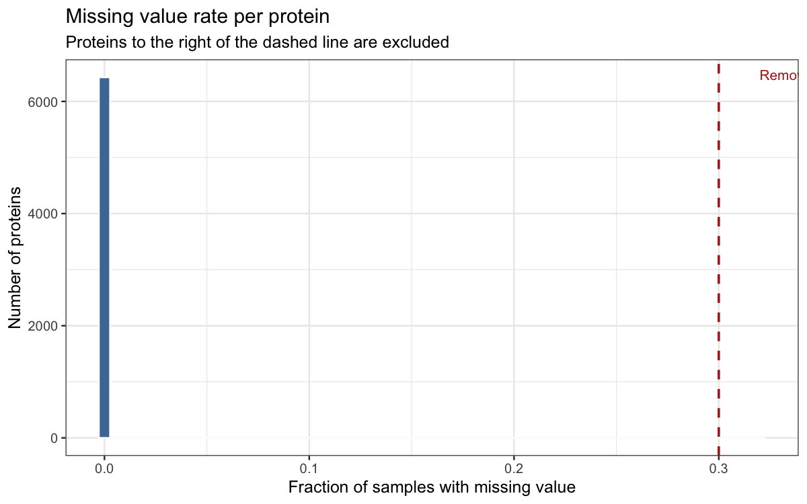

``` r
# 1. Remove high-missing proteins
prot_filtered <- prot_wide[, missing_per_protein <= MISSING_THRESHOLD]
cat(sprintf("Proteins removed (> %d%% missing): %d | Remaining: %d\n",
            as.integer(MISSING_THRESHOLD * 100),
            ncol(prot_wide) - ncol(prot_filtered),
            ncol(prot_filtered)))
```

    ## Proteins removed (> 30% missing): 0 | Remaining: 6429

``` r
# 2. Remove outlier samples
outlier_samples <- names(missing_per_sample[missing_per_sample > 0.40])
if (length(outlier_samples) > 0) {
  cat("Outlier samples removed:", paste(outlier_samples, collapse = ", "), "\n")
  prot_filtered <- prot_filtered[!rownames(prot_filtered) %in% outlier_samples, ]
} else {
  cat("No outlier samples detected.\n")}
```

    ## No outlier samples detected.

``` r
# 3. KNN imputation for remaining NAs
cat("Running KNN imputation (k = 10) on global proteome...\n")
```

    ## Running KNN imputation (k = 10) on global proteome...

``` r
prot_imputed <- prot_filtered |>
  t() |>
  impute.knn(k = 10) |>
  _$data |> t()
```

    ## Cluster size 6429 broken into 5848 581 
    ## Cluster size 5848 broken into 3800 2048 
    ## Cluster size 3800 broken into 678 3122 
    ## Done cluster 678 
    ## Cluster size 3122 broken into 22 3100 
    ## Done cluster 22 
    ## Cluster size 3100 broken into 1999 1101 
    ## Cluster size 1999 broken into 934 1065 
    ## Done cluster 934 
    ## Done cluster 1065 
    ## Done cluster 1999 
    ## Done cluster 1101 
    ## Done cluster 3100 
    ## Done cluster 3122 
    ## Done cluster 3800 
    ## Cluster size 2048 broken into 1275 773 
    ## Done cluster 1275 
    ## Done cluster 773 
    ## Done cluster 2048 
    ## Done cluster 5848 
    ## Done cluster 581

``` r
# Strip cBioPortal "|GENENAME" suffix and pipe characters once, so every
# downstream step sees clean, formula-safe gene symbols.
colnames(prot_imputed) <- str_remove(colnames(prot_imputed), "\\|.*$")
colnames(prot_imputed) <- gsub("\\|", "_", colnames(prot_imputed))

cat("Final global-proteomics matrix:", nrow(prot_imputed), "samples ×",
    ncol(prot_imputed), "proteins\n")
```

    ## Final global-proteomics matrix: 218 samples × 6429 proteins

``` r
# Same QC pass for phosphoproteomics — different matrix, same logic
phos_miss_protein <- colMeans(is.na(phos_wide))
phos_miss_sample <- rowMeans(is.na(phos_wide))
phos_filtered <- phos_wide[, phos_miss_protein <= MISSING_THRESHOLD]
phos_outliers <- names(phos_miss_sample[phos_miss_sample > 0.40])
if (length(phos_outliers) > 0) {
  phos_filtered <- phos_filtered[!rownames(phos_filtered) %in% phos_outliers, ]}
cat("Running KNN imputation on phosphoproteome (k = 10)...\n")
```

    ## Running KNN imputation on phosphoproteome (k = 10)...

``` r
phos_imputed <- phos_filtered |>
  t() |>
  impute.knn(k = 10) |>
  _$data |> t()
```

    ## Cluster size 4548 broken into 4081 467 
    ## Cluster size 4081 broken into 1445 2636 
    ## Done cluster 1445 
    ## Cluster size 2636 broken into 342 2294 
    ## Done cluster 342 
    ## Cluster size 2294 broken into 1820 474 
    ## Cluster size 1820 broken into 1212 608 
    ## Done cluster 1212 
    ## Done cluster 608 
    ## Done cluster 1820 
    ## Done cluster 474 
    ## Done cluster 2294 
    ## Done cluster 2636 
    ## Done cluster 4081 
    ## Done cluster 467

``` r
cat("Final phosphoproteomics matrix:", nrow(phos_imputed), "samples ×",
    ncol(phos_imputed), "phosphosites")
```

    ## Final phosphoproteomics matrix: 217 samples × 4548 phosphosites

We also build a **`samples_matched`** helper at this point. Several
downstream models (PLS-DA, RF, RSF, the §15 classifier) need the samples
table aligned row-for-row with the proteomics matrix, and creating this
once upfront eliminates a class of subtle indexing bugs.

``` r
# Align samples table to the rows of prot_imputed (after QC dropped outliers)
samples_matched <- samples[match(rownames(prot_imputed), samples$sample_id), ]
stopifnot(all(rownames(prot_imputed) == samples_matched$sample_id))

# A factor of histological subtype, used as the response in supervised viz below
Y <- factor(samples_matched$cancer_type_detailed)
cat("samples_matched aligned:", nrow(samples_matched), "rows\n")
```

    ## samples_matched aligned: 218 rows

``` r
cat("Class distribution (Y):\n"); print(table(Y))
```

    ## Class distribution (Y):

    ## Y
    ##         Atypical Teratoid/Rhabdoid Tumor 
    ##                                       12 
    ## Craniopharyngioma, Adamantinomatous Type 
    ##                                       16 
    ##                        Ependymomal Tumor 
    ##                                       32 
    ##                            Ganglioglioma 
    ##                                       18 
    ##                          Medulloblastoma 
    ##                                       22 
    ##             Pediatric High Grade Gliomas 
    ##                                       25 
    ##              Pediatric Low Grade Gliomas 
    ##                                       93

------------------------------------------------------------------------

## 4. Exploratory Analysis

Before committing to NMF, we look at the data with three complementary
projections. None of these define our final clusters; their job is only
to confirm that meaningful structure exists, and to flag whether that
structure is dominated by a small number of subtypes.

### 4.1 PCA

PCA gives a first, unsupervised look. We deliberately leave the data
un-scaled here because the cBioPortal proteomics file is already
z-scored per protein.

``` r
prot_scaled <- prot_imputed # data is already z-scored upstream
pca_res <- prcomp(prot_scaled, scale. = FALSE)
var_expl <- round(100 * pca_res$sdev^2 / sum(pca_res$sdev^2), 2)

cat(sprintf("Top 3 PCs explain %.1f%% of total variance.\n",
            sum(var_expl[1:3])))
```

    ## Top 3 PCs explain 45.8% of total variance.

``` r
cat(sprintf("Top %d PCs explain %.1f%% of total variance.",
            N_PCS, sum(var_expl[1:N_PCS])))
```

    ## Top 25 PCs explain 76.8% of total variance.

``` r
data.frame(PC = seq_along(var_expl), variance = var_expl) |>
  filter(PC <= 100) |>
  ggplot(aes(x = PC, y = variance)) +
  geom_line(colour = "#4E79A7") +
  geom_point(size = 1.5, colour = "#4E79A7") +
  geom_vline(xintercept = N_PCS, linetype = "dashed",
             colour = "firebrick", linewidth = 0.8) +
  annotate("text", x = N_PCS + 1, y = max(var_expl) * 0.75,
           label = paste0("Retain top ", N_PCS, " PCs"),
           colour = "firebrick", hjust = 0, size = 3.5) +
  labs(title = "Scree plot: variance explained per PC",
       x = "Principal Component", y = "Variance explained (%)") +
  theme_bw(base_size = 12)
```

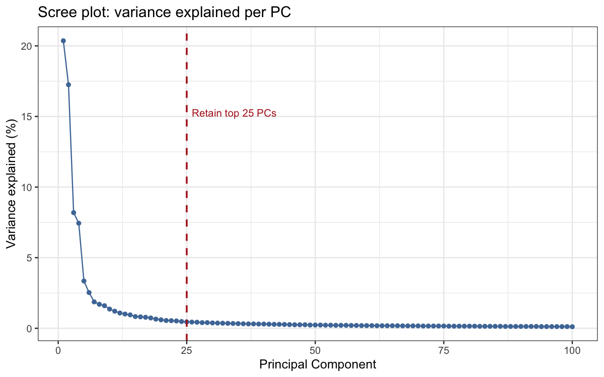

``` r
pca_df <- as.data.frame(pca_res$x[, 1:5]) |>
  rownames_to_column("sample_id") |>
  left_join(select(samples, sample_id, cancer_type_detailed), by = "sample_id")

ggplot(pca_df, aes(x = PC1, y = PC2, colour = cancer_type_detailed)) +
  geom_point(alpha = 0.75, size = 2.5) +
  labs(title = "PCA of QC-passed proteomics",
       subtitle = "Colour = histological subtype",
       x = paste0("PC1 (", var_expl[1], "% var)"),
       y = paste0("PC2 (", var_expl[2], "% var)"),
       colour = "Subtype") +
  theme_bw(base_size = 12)
```

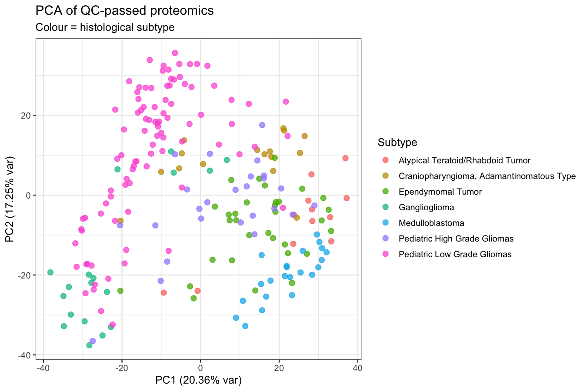

### 4.2 PLS-DA (supervised projection by histology)

PLS-DA asks the complementary question: if we explicitly use histology
as the response, how separable are the subtypes in proteomic space?
Strong separation here means histology is a real (but not necessarily
complete) source of variation.

``` r
plsda_res <- plsda(prot_imputed, Y, ncomp = 5)
plotIndiv(plsda_res, comp = c(1, 2), group = Y,
          ind.names = FALSE, ellipse = TRUE, legend = TRUE,
          legend.title = "Histological subtype",
          X.label = "PLS-DA component 1",
          Y.label = "PLS-DA component 2",
          title = "PLS-DA of QC-passed proteomics (components 1 vs 2)")
```

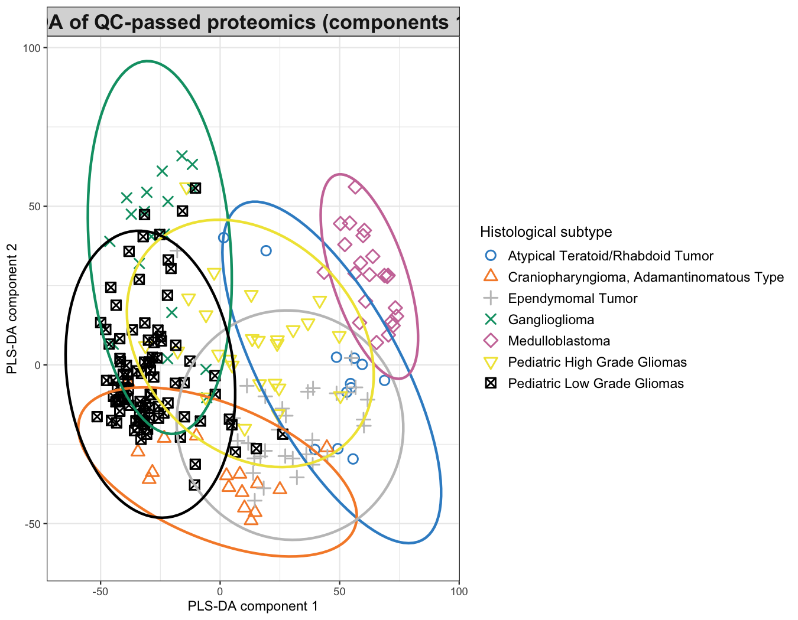

``` r
set.seed(42)
perf_res <- perf(plsda_res, validation = "Mfold", folds = 5,
                 nrepeat = 10, progressBar = FALSE)
plot(perf_res, col = color.mixo(1:3),
     main = "PLS-DA cross-validated classification error vs number of components",
     xlab = "Number of components",
     ylab = "Classification error rate (5-fold CV, 10 repeats)")
```

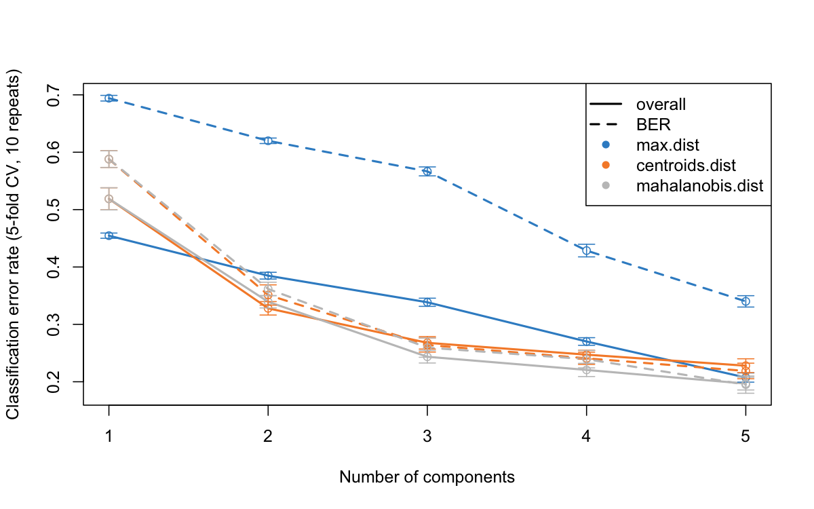

``` r
plotLoadings(plsda_res, comp = 1, method = "mean", contrib = "max",
             ndisplay = 20,
             title = "Top 20 proteins by loading magnitude, PLS-DA component 1",
             size.title = 0.9)
```

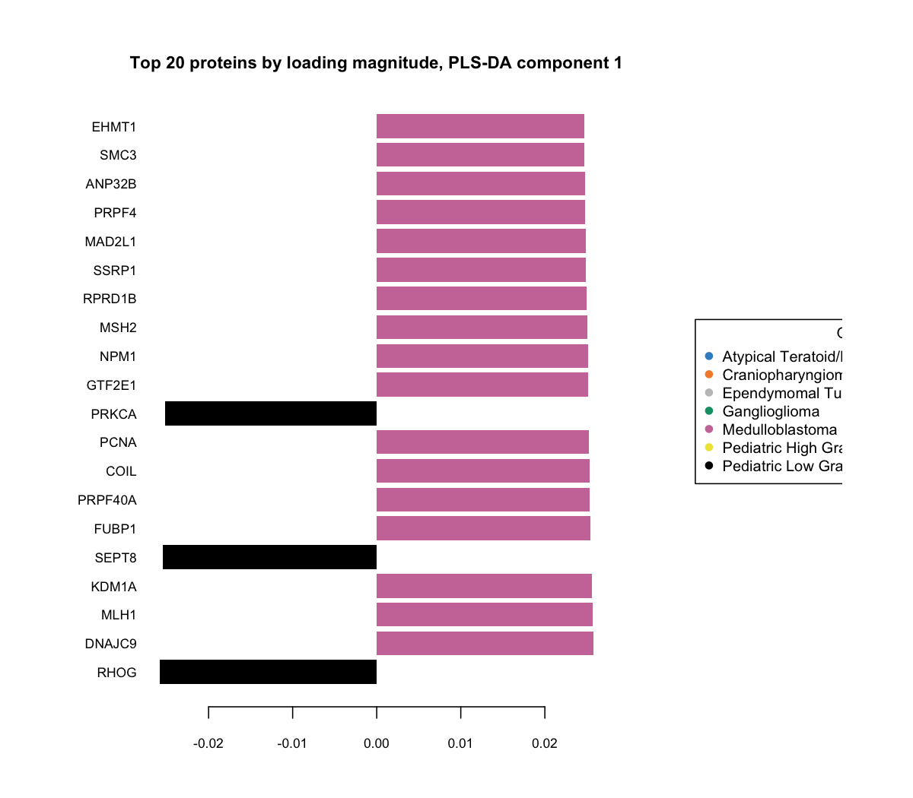

``` r
plotLoadings(plsda_res, comp = 2, method = "mean", contrib = "max",
             ndisplay = 20,
             title = "Top 20 proteins by loading magnitude, PLS-DA component 2",
             size.title = 0.9)
```

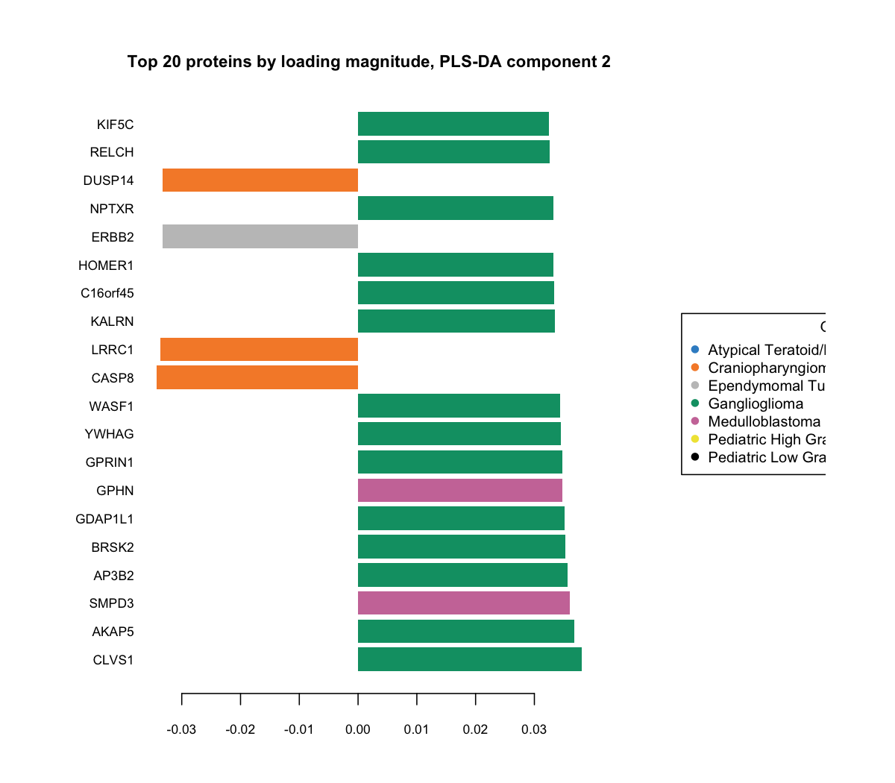

### 4.3 Sparse PLS-DA (feature selection by histology)

sPLS-DA adds an L1 penalty so that each component is built from only a
few proteins. This is a useful first pass at “which proteins distinguish
which histology?”, and the chosen proteins reappear in the differential
expression section later.

``` r
set.seed(42)
tune_splsda <- tune.splsda(
  X = prot_imputed, Y = Y, ncomp = 3,
  test.keepX = c(5, 10, 15, 20, 25, 30, 50),
  validation = "Mfold", folds = 5, nrepeat = 10,
  dist = "centroids.dist", progressBar = FALSE)
tune_splsda$choice.keepX
```

    ## comp1 comp2 comp3 
    ##    50    15    15

``` r
# mixOmics' plot.tune.splsda returns a ggplot, so add the title via ggtitle()
# rather than base graphics title() (which would error: plot.new not called).
plot(tune_splsda) +
  ggtitle("sPLS-DA tuning: error rate vs number of selected proteins per component") +
  theme(plot.title = element_text(size = 12, face = "bold"))
```

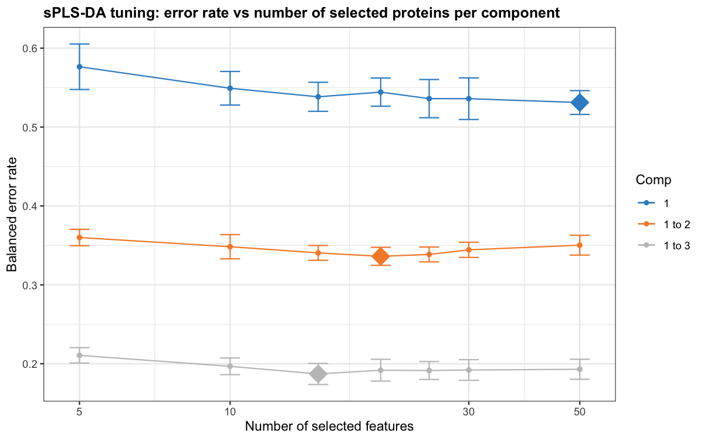

``` r
optimal_keepX <- tune_splsda$choice.keepX
splsda_res <- splsda(X = prot_imputed, Y = Y, ncomp = 3, keepX = optimal_keepX)
plotIndiv(splsda_res, comp = c(1, 2), group = Y,
          ind.names = FALSE, ellipse = TRUE, legend = TRUE,
          legend.title = "Histological subtype",
          X.label = "sPLS-DA component 1",
          Y.label = "sPLS-DA component 2",
          title = "sPLS-DA of QC-passed proteomics (sparse component projection)")
```

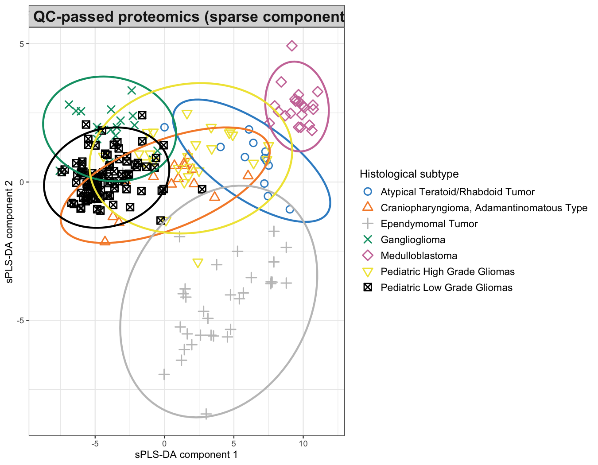

``` r
plotLoadings(splsda_res, comp = 1, method = "mean", contrib = "max",
             ndisplay = 20,
             title = "Top 20 proteins by loading magnitude, sPLS-DA component 1",
             size.title = 0.9)
```

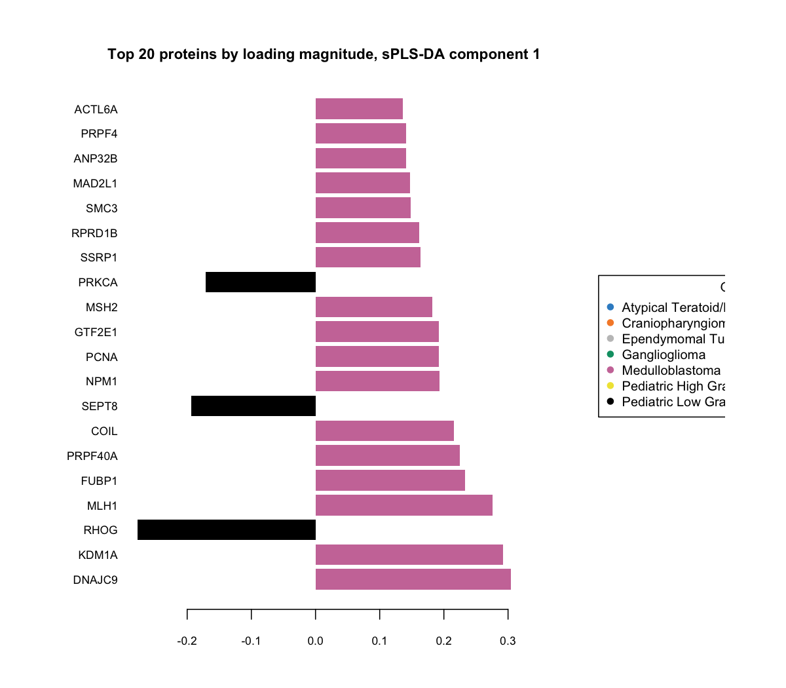

### 4.4 UMAP (non-linear sanity check)

UMAP is not used for clustering downstream, it is only a non-linear
sanity check that the structure visible in PCA persists when distances
are preserved more faithfully.

``` r
umap_res <- umap(prot_imputed)
umap_df  <- as.data.frame(umap_res$layout) |> mutate(subtype = Y)
ggplot(umap_df, aes(x = V1, y = V2, colour = subtype)) +
  geom_point(alpha = 0.75, size = 2.5) +
  scale_colour_brewer(palette = "Set3") +
  labs(title = "UMAP of QC-passed proteomics",
       subtitle = "Non-linear projection (sanity check); colour = histological subtype",
       x = "UMAP dimension 1", y = "UMAP dimension 2",
       colour = "Subtype") +
  theme_bw(base_size = 12)
```

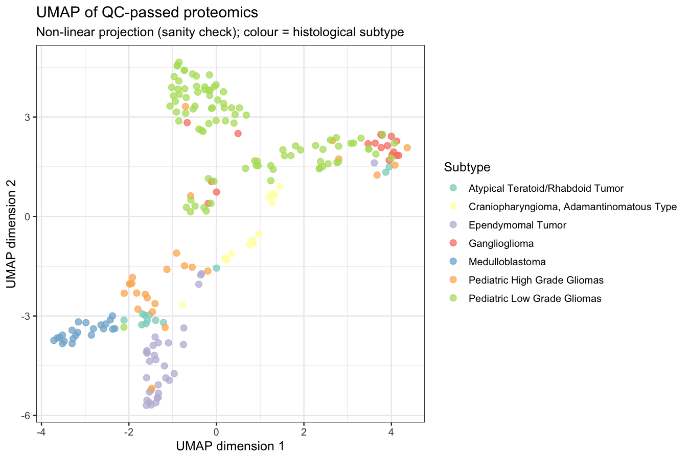

------------------------------------------------------------------------

## 5. Dimensionality Reduction (PCA to NMF input)

Running NMF directly on ~6,000 protein columns is noisy and slow. We
compress the matrix to its top `N_PCS` principal components and shift
the resulting score matrix to be non-negative (NMF’s only hard
requirement). The shift is a uniform additive constant and therefore
preserves all pairwise distances.

``` r
pca_scores <- pca_res$x[, 1:N_PCS]
pca_scores_nn <- pca_scores - min(pca_scores)

cat("NMF input matrix:", nrow(pca_scores_nn), "samples ×",
    ncol(pca_scores_nn), "PCs\n")
```

    ## NMF input matrix: 218 samples × 25 PCs

``` r
cat("Value range: [", round(min(pca_scores_nn), 3), ",",
    round(max(pca_scores_nn), 3), "]")
```

    ## Value range: [ 0 , 82.315 ]

------------------------------------------------------------------------

## 6. Selecting the Number of Clusters (k)

**Note on `BEST_K`.** Automated metrics on this dataset tend to favour
very low k (2–3), which collapses biologically distinct subtypes
(e.g. HGG vs LGG) into a single cluster. The default fallback is
`BEST_K = 5`.

We sweep k from `K_MIN` to `K_MAX` and evaluate three complementary
stability metrics derived from the NMF consensus matrix:

- **Cophenetic correlation**: how faithfully the consensus matrix
  preserves sample distances (close to 1 = stable).
- **Dispersion**: how bimodal the consensus matrix is (values close to 0
  or 1 are good).
- **Silhouette score**: how well-separated clusters are in feature
  space.

**Bug fixed in v3:** The NMF R package’s convention is features ×
samples (features as rows, samples as columns). pca_scores_nn is 218
samples × 25 PCs. When you pass it directly (without transpose), NMF
treats the 25 PCs as “samples” and the 218 rows as “features” — so it
clusters the 25 PCs into k groups, which is meaningless. Passing
t(pca_scores_nn) makes it 25 PCs × 218 samples, so NMF correctly treats
the 218 samples as the things being clustered and the 25 PCs as their
features. This is what the current code does.

``` r
# Slowest cell in the notebook. Set cache=TRUE after first run.
# Note the transpose: NMF treats columns as samples for clustering purposes,
# and the final NMF below uses the same orientation.
nmf_estimates <- nmf(
  t(pca_scores_nn),
  rank = K_MIN:K_MAX,
  nrun = NMF_RUNS,
  seed = 42,
  method = "brunet",
  .options = "v")
```

    ## Compute NMF rank= 2  ... + measures ... OK
    ## Compute NMF rank= 3  ... + measures ... OK
    ## Compute NMF rank= 4  ... + measures ... OK
    ## Compute NMF rank= 5  ... + measures ... OK
    ## Compute NMF rank= 6  ... + measures ... OK
    ## Compute NMF rank= 7  ... + measures ... OK
    ## Compute NMF rank= 8  ... + measures ... OK

``` r
k_metrics <- nmf_estimates$measures |>
  as_tibble() |>
  rename(k = rank, silhouette = silhouette.consensus) |>
  select(k, cophenetic, dispersion, silhouette, rss)

cat("Metrics across k:\n"); print(k_metrics)
```

    ## Metrics across k:

    ## # A tibble: 7 × 5
    ##       k cophenetic dispersion silhouette     rss
    ##   <dbl>      <dbl>      <dbl>      <dbl>   <dbl>
    ## 1     2      0.875      0.411      0.660 219221.
    ## 2     3      0.892      0.567      0.684 151875.
    ## 3     4      0.852      0.483      0.506 119961.
    ## 4     5      0.807      0.485      0.388  91029.
    ## 5     6      0.846      0.557      0.400  77961.
    ## 6     7      0.819      0.597      0.334  68066.
    ## 7     8      0.848      0.637      0.369  60830.

``` r
k_metrics |>
  pivot_longer(-k, names_to = "metric", values_to = "value") |>
  ggplot(aes(x = k, y = value)) +
  geom_line(colour = "#4E79A7", linewidth = 1) +
  geom_point(size = 3, colour = "#4E79A7") +
  facet_wrap(~ metric, scales = "free_y", ncol = 2) +
  scale_x_continuous(breaks = K_MIN:K_MAX) +
  labs(title = "NMF model selection across k",
       subtitle = "Choose k where cophenetic and silhouette peak together",
       x = "Number of clusters (k)", y = "Metric value") +
  theme_bw(base_size = 12)
```

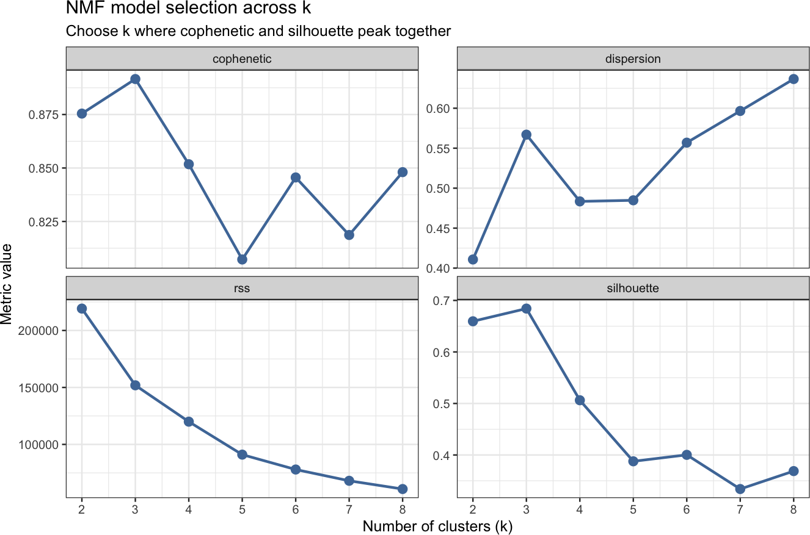

``` r
# Compute mean cluster purity across k: fraction of the most common histology
# per cluster, averaged across clusters. Captures biological resolution
# independently of stability metrics.
purity_by_k <- map_dfr(K_MIN:K_MAX, function(k) {
  fit_k <- nmf_estimates$fit[[as.character(k)]]
  cm    <- coef(fit_k)
  labs  <- apply(t(cm), 1, which.max)
  hist_vec <- samples_matched$cancer_type_detailed[
    match(names(labs), rownames(prot_imputed))]
  tbl <- tibble(cluster = labs, histology = hist_vec)
  purity <- tbl |>
    group_by(cluster) |>
    summarise(purity = max(table(histology)) / n(), .groups = "drop") |>
    pull(purity) |> mean()
  tibble(k = k, mean_purity = purity)})

# Combined plot: stability metrics + purity, with selected k marked
k_metrics |>
  left_join(purity_by_k, by = "k") |>
  pivot_longer(-k, names_to = "metric", values_to = "value") |>
  mutate(metric = factor(metric,
    levels = c("cophenetic", "silhouette", "dispersion", "mean_purity", "rss"),
    labels = c("Cophenetic", "Silhouette", "Dispersion", "Mean cluster purity", "RSS"))) |>
  ggplot(aes(x = k, y = value)) +
  geom_line(colour = "#4E79A7", linewidth = 1) +
  geom_point(size = 3, colour = "#4E79A7") +
  geom_vline(xintercept = 3, linetype = "dashed",
             colour = "firebrick", linewidth = 0.7) +
  facet_wrap(~ metric, scales = "free_y", ncol = 5) +
  scale_x_continuous(breaks = K_MIN:K_MAX) +
  labs(title = "NMF model selection across k, stability metrics and biological purity",
       subtitle = paste0("Dashed line = selected k = 3. Cophenetic, silhouette, and purity all peak at k = 3.\n",
                         "Purity increases monotonically at k > 5 only because smaller clusters trivially",
                         " capture single histologies (silhouette < 0.40 for k ≥ 5)."),
       x = "Number of clusters (k)", y = "Metric value") +
  theme_bw(base_size = 11) +
  theme(plot.subtitle = element_text(size = 9))
```

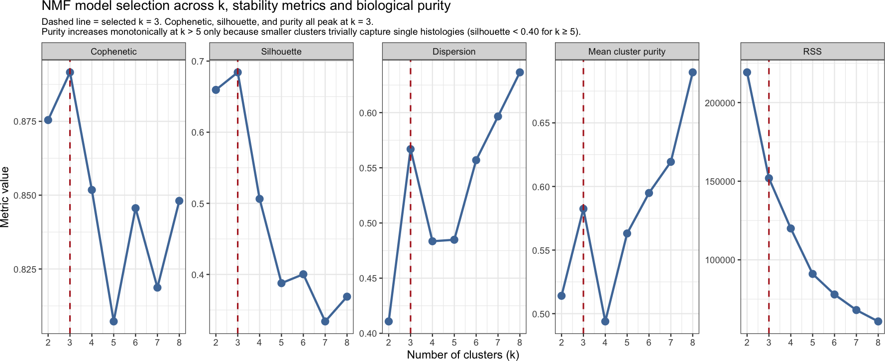

``` r
cat("Purity by k:\n"); print(purity_by_k)
```

    ## Purity by k:

    ## # A tibble: 7 × 2
    ##       k mean_purity
    ##   <int>       <dbl>
    ## 1     2       0.514
    ## 2     3       0.582
    ## 3     4       0.494
    ## 4     5       0.563
    ## 5     6       0.595
    ## 6     7       0.619
    ## 7     8       0.690

``` r
# Use BEST_K = 5 as a sensible default for this cohort. If the sweep above
# has been run and k_metrics exists, prefer the data-driven choice (highest
# dispersion).
if (exists("k_metrics")) {
  BEST_K <- k_metrics$k[which.max(k_metrics$silhouette)]
  cat(sprintf("Data-driven k = %d  (silhouette = %.3f, cophenetic = %.3f)\n",
              BEST_K,
              k_metrics$silhouette[k_metrics$k == BEST_K],
              k_metrics$cophenetic[k_metrics$k == BEST_K]))
} else {
  BEST_K <- 5
  cat("Defaulting to BEST_K =", BEST_K,
      "(automated sweep not run; see chunk options)\n")
}
```

    ## Data-driven k = 3  (silhouette = 0.684, cophenetic = 0.892)

------------------------------------------------------------------------

## 7. Consensus NMF Clustering

With `BEST_K` chosen, we run a final NMF and extract the consensus
matrix and cluster labels.

**Interpreting the consensus heatmap:**

- Dark blue diagonal blocks indicate patients always cluster together
  (stable).
- Light off-diagonal regions indicate patients from different clusters
  never co-cluster (good separation).
- Mixed histologies within a cluster indicate cross-boundary molecular
  grouping, a key finding of the original paper.

``` r
nmf_best <- nmf(
  t(pca_scores_nn), # transpose: features (PCs) as rows, samples as columns
  rank = BEST_K,
  nrun = NMF_RUNS,
  seed = 42,
  method = "brunet",
  .options = "vr")
```

    ## Runs: |                                                        Runs: |                                                  |   0%Runs: |                                                        Runs: |==                                                |   5%Runs: |                                                        Runs: |=====                                             |  10%Runs: |                                                        Runs: |                                                        Runs: |==========                                        |  19%Runs: |==========                                        |  19%Runs: |                                                        Runs: |==============                                    |  29%Runs: |                                                        Runs: |===================                               |  38%Runs: |                                                        Runs: |========================                          |  48%Runs: |                                                        Runs: |=============================                     |  57%Runs: |                                                        Runs: |=================================                 |  67%Runs: |                                                        Runs: |======================================            |  76%Runs: |                                                        Runs: |===========================================       |  86%Runs: |                                                        Runs: |================================================  |  95%Runs: |                                                        Runs: |==================================================| 100%
    ## System time:
    ##    user  system elapsed 
    ##  22.798  35.669  38.039

``` r
# Extract consensus matrix
cons_matrix <- consensus(nmf_best) # 218×218 expected

# Assign each sample to the cluster with its highest NMF coefficient.
# We use coef() rather than predict() because predict() can collapse to a
# single cluster when one component dominates; per-sample argmax across
# coef() is more reliable.
basis_mat <- basis(nmf_best) # features × k (25 × BEST_K)
coef_mat  <- coef(nmf_best)  # k × samples (BEST_K × 218)
cluster_labels <- apply(t(coef_mat), 1, which.max)
names(cluster_labels) <- colnames(coef_mat)

cat("cons_matrix dim:", dim(cons_matrix), "\n")
```

    ## cons_matrix dim: 218 218

``` r
cat("Cluster distribution:\n"); print(table(cluster_labels))
```

    ## Cluster distribution:

    ## cluster_labels
    ##  1  2  3 
    ## 93 73 52

``` r
# Build the canonical sample annotation table. This is the single source of
# truth for cluster + clinical metadata used by every downstream chunk.
sample_ann <- tibble(sample_id = names(cluster_labels),
                     cluster = paste0("C", cluster_labels)) |>
  left_join(select(samples, sample_id, cancer_type_detailed,
                   os_months, os_event),
            by = "sample_id") |>
  column_to_rownames("sample_id")

# Colour palettes
cluster_colours <- setNames(
  brewer.pal(max(BEST_K, 3), "Set2")[1:BEST_K],
  paste0("C", 1:BEST_K))
subtypes_present <- unique(sample_ann$cancer_type_detailed)
subtype_colours <- setNames(
  colorRampPalette(brewer.pal(8, "Set3"))(length(subtypes_present)),
  subtypes_present)

# Sort by cluster using the cons_matrix row order so the annotation and
# the matrix stay aligned no matter how rownames were originally ordered
sample_order <- order(cluster_labels[rownames(cons_matrix)])
cons_matrix_ordered <- cons_matrix[sample_order, sample_order]
ordered_sample_ids <- rownames(cons_matrix)[sample_order]
ann_ordered <- sample_ann[ordered_sample_ids,
                          c("cluster", "cancer_type_detailed"), drop = FALSE]

pheatmap(cons_matrix_ordered,
  cluster_rows = FALSE, cluster_cols = FALSE,
  annotation_col = ann_ordered,
  annotation_colors = list(cluster = cluster_colours,
                           cancer_type_detailed = subtype_colours),
  color = colorRampPalette(c("white", "#2171B5"))(100),
  border_color = NA, show_rownames = FALSE, show_colnames = FALSE,
  main = paste0("Consensus matrix, k = ", BEST_K),
  fontsize = 10)
```

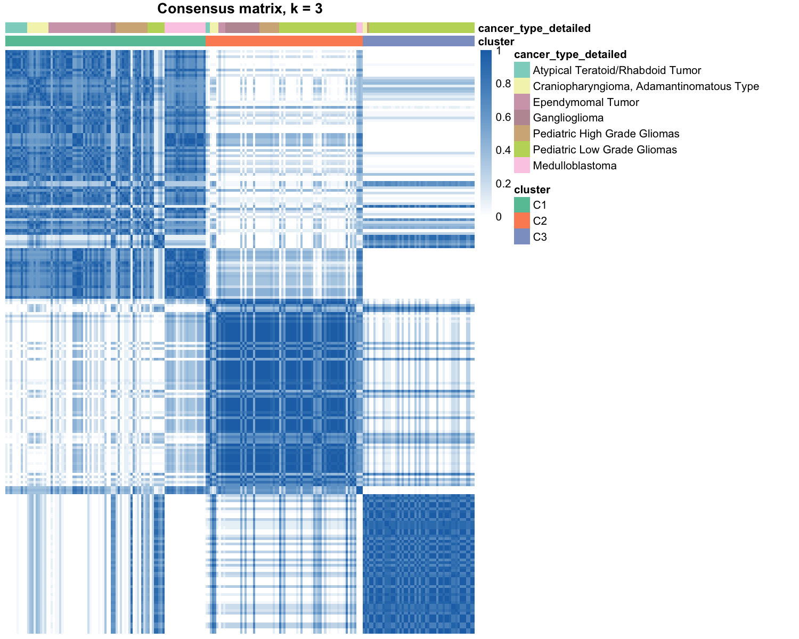

------------------------------------------------------------------------

## 8. Cluster Annotation

Before running biology, we assemble a single tidy table that joins
cluster labels with the patient-level survival and demographic fields.
Doing this once here means later chunks can stay focused on modelling.

``` r
cluster_df <- tibble(
  sample_id = names(cluster_labels),
  cluster = as.integer(cluster_labels)) |>
  left_join(
    select(samples, sample_id, patient_id, cancer_type_detailed, tumor_type,
           os_months, os_event, dfs_months, dfs_event,
           age, sex, grade, extent_resection, radiation_yn, chemotherapy_yn,
           braf_status, h3f3a_ctnnb1_status, ependymoma_rela_status,
           hgg_h3f3a_status, lgg_braf_status, ctnnb1_status),
    by = "sample_id")

cat("Cluster sizes:\n"); cluster_df |> count(cluster) |> print()
```

    ## Cluster sizes:

    ## # A tibble: 3 × 2
    ##   cluster     n
    ##     <int> <int>
    ## 1       1    93
    ## 2       2    73
    ## 3       3    52

``` r
cat("Missing os_months:", sum(is.na(cluster_df$os_months)), "\n")
```

    ## Missing os_months: 7

``` r
cat("Missing dfs_months:", sum(is.na(cluster_df$dfs_months)), "\n")
```

    ## Missing dfs_months: 7

``` r
# Per-cluster survival summary (records, events, median OS, etc.)
cluster_df |>
  filter(!is.na(os_months)) |>
  group_by(cluster) |>
  summarise(
    n = n(),
    n_events = sum(os_event, na.rm = TRUE),
    event_rate = round(sum(os_event, na.rm = TRUE) / n() * 100, 1),
    median_os = median(os_months, na.rm = TRUE),
    mean_os = round(mean(os_months, na.rm = TRUE), 1)
  )
```

    ## # A tibble: 3 × 6
    ##   cluster     n n_events event_rate median_os mean_os
    ##     <int> <int>    <int>      <dbl>     <dbl>   <dbl>
    ## 1       1    92       33       35.9      32.5    41  
    ## 2       2    73       13       17.8      34      47.4
    ## 3       3    46        1        2.2      38.5    52.9

------------------------------------------------------------------------

## 9. Histological Composition per Cluster

Do the proteomics-derived clusters recapitulate known histology, or do
they reveal cross-boundary groupings? This needs to be answered before
survival analysis: a cluster that is 100% Medulloblastoma is just
re-discovering the diagnosis, while a cluster that mixes histologies is
genuinely informative.

``` r
# Short display names for the 7 histological subtypes, long strings break axes
histo_short <- c(
  "Atypical Teratoid/Rhabdoid Tumor" = "ATRT",
  "Craniopharyngioma, Adamantinomatous Type" = "Cranio",
  "Ependymomal Tumor" = "Ependymoma",
  "Ganglioglioma" = "Ganglioglioma",
  "Medulloblastoma" = "Medulloblastoma",
  "Pediatric High Grade Gliomas" = "pHGG",
  "Pediatric Low Grade Gliomas" = "pLGG")
histo_pal <- c(
  "ATRT" = "#E41A1C",
  "Cranio" = "#FF7F00",
  "Ependymoma" = "#984EA3",
  "Ganglioglioma" = "#4DAF4A",
  "Medulloblastoma" = "#377EB8",
  "pHGG" = "#A65628",
  "pLGG" = "#F781BF")

comp_df <- cluster_df |>
  filter(!is.na(cancer_type_detailed)) |>
  mutate(
    histology_short = histo_short[cancer_type_detailed],
    # Apply biological names; keep cluster integer for sorting
    cluster_label = factor(
      CLUSTER_NAMES[paste0("C", cluster)],
      levels = unname(CLUSTER_NAMES)))

# Main stacked bar, cluster on x-axis, histology as fill
comp_df |>
  count(cluster_label, histology_short) |>
  group_by(cluster_label) |>
  mutate(pct = n / sum(n) * 100) |>
  ungroup() |>
  ggplot(aes(x = cluster_label, y = pct, fill = histology_short)) +
  geom_col(colour = "white", linewidth = 0.4) +
  scale_fill_manual(values = histo_pal, name = "Histological subtype") +
  scale_y_continuous(expand = c(0, 0), limits = c(0, 101)) +
  labs(title = "Proteomic subtypes cut across histological boundaries",
       subtitle = sprintf(
         "k = %d proteomic subtypes span all %d histological diagnoses, shared molecular programmes cross diagnostic lines",
         BEST_K,
         length(unique(comp_df$histology_short))),
       x = "Proteomic subtype",
       y = "Percentage of samples (%)") +
  theme_bw(base_size = 12) +
  theme(axis.text.x = element_text(angle = 12, hjust = 1))
```

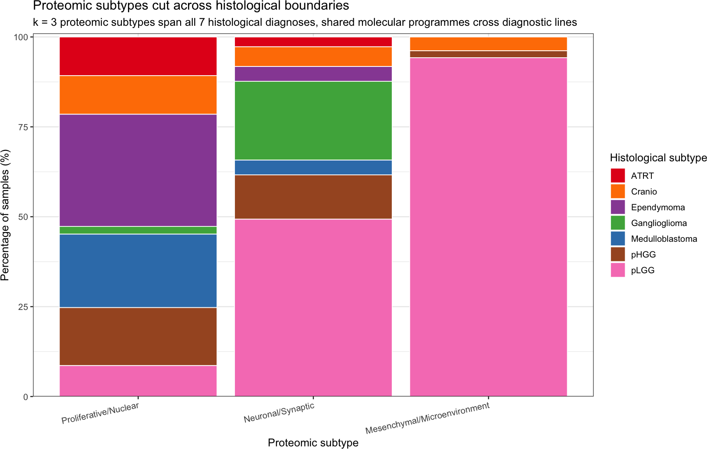

``` r
# Reverse view: for each histological diagnosis, how are its patients
# distributed across proteomic subtypes? Shows that most diagnoses are
# molecularly heterogeneous, not captured by a single cluster.
comp_df |>
  count(histology_short, cluster_label) |>
  group_by(histology_short) |>
  mutate(pct = n / sum(n) * 100) |>
  ungroup() |>
  ggplot(aes(x = histology_short, y = pct, fill = cluster_label)) +
  geom_col(colour = "white", linewidth = 0.4) +
  scale_fill_brewer(palette = "Set2", name = "Proteomic subtype") +
  scale_y_continuous(expand = c(0, 0), limits = c(0, 101)) +
  labs(title = "Distribution of proteomic subtypes within each histological diagnosis",
       subtitle = "Most diagnoses spread across multiple proteomic subtypes, the proteome resolves heterogeneity invisible to histopathology",
       x = "Histological diagnosis",
       y = "Percentage of patients (%)") +
  theme_bw(base_size = 12) +
  theme(axis.text.x = element_text(angle = 18, hjust = 1))
```

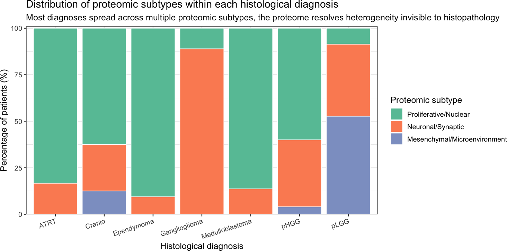

``` r
table(sample_ann$cluster, sample_ann$cancer_type_detailed)
```

    ##     
    ##      Atypical Teratoid/Rhabdoid Tumor Craniopharyngioma, Adamantinomatous Type
    ##   C1                               10                                       10
    ##   C2                                2                                        4
    ##   C3                                0                                        2
    ##     
    ##      Ependymomal Tumor Ganglioglioma Medulloblastoma
    ##   C1                29             2              19
    ##   C2                 3            16               3
    ##   C3                 0             0               0
    ##     
    ##      Pediatric High Grade Gliomas Pediatric Low Grade Gliomas
    ##   C1                           15                           8
    ##   C2                            9                          36
    ##   C3                            1                          49

``` r
prop.table(table(sample_ann$cluster, sample_ann$cancer_type_detailed),
           margin = 1) |> round(2)
```

    ##     
    ##      Atypical Teratoid/Rhabdoid Tumor Craniopharyngioma, Adamantinomatous Type
    ##   C1                             0.11                                     0.11
    ##   C2                             0.03                                     0.05
    ##   C3                             0.00                                     0.04
    ##     
    ##      Ependymomal Tumor Ganglioglioma Medulloblastoma
    ##   C1              0.31          0.02            0.20
    ##   C2              0.04          0.22            0.04
    ##   C3              0.00          0.00            0.00
    ##     
    ##      Pediatric High Grade Gliomas Pediatric Low Grade Gliomas
    ##   C1                         0.16                        0.09
    ##   C2                         0.12                        0.49
    ##   C3                         0.02                        0.94

``` r
# Top 3 dominant subtypes per cluster
as.data.frame(table(sample_ann$cluster, sample_ann$cancer_type_detailed)) |>
  rename(cluster = Var1, subtype = Var2, n = Freq) |>
  group_by(cluster) |>
  slice_max(n, n = 3) |>
  arrange(cluster, desc(n))
```

    ## # A tibble: 9 × 3
    ## # Groups:   cluster [3]
    ##   cluster subtype                                      n
    ##   <fct>   <fct>                                    <int>
    ## 1 C1      Ependymomal Tumor                           29
    ## 2 C1      Medulloblastoma                             19
    ## 3 C1      Pediatric High Grade Gliomas                15
    ## 4 C2      Pediatric Low Grade Gliomas                 36
    ## 5 C2      Ganglioglioma                               16
    ## 6 C2      Pediatric High Grade Gliomas                 9
    ## 7 C3      Pediatric Low Grade Gliomas                 49
    ## 8 C3      Craniopharyngioma, Adamantinomatous Type     2
    ## 9 C3      Pediatric High Grade Gliomas                 1

**What to look for:** Clusters dominated by a single histological
subtype mostly recapitulate known diagnoses. Clusters that mix several
subtypes, for example LGG alongside Ependymoma, are more interesting
(and common here): they suggest a shared underlying molecular programme
that cuts across classical histological boundaries, which is the central
finding of Petralia et al. (2020).

------------------------------------------------------------------------

## 10. Survival Analysis (Kaplan–Meier)

A key clinical test: do the identified subgroups have different survival
outcomes? We use Kaplan–Meier curves and the log-rank test. A
significant p-value (\< 0.05) means the clusters capture clinically
meaningful biology, not just abstract molecular similarity.

``` r
# For patients with multiple samples, keep only one row per patient
surv_data <- cluster_df |>
  filter(!is.na(os_months) & os_months > 0) |>
  group_by(patient_id) |> slice(1) |> ungroup() |>
  mutate(cluster = factor(paste0("C", cluster)),
         os_days = os_months * 30.44) # months to days

cat("Patients:", nrow(surv_data), "Events:", sum(surv_data$os_event))
```

    ## Patients: 187 Events: 37

``` r
fit <- survfit(Surv(os_days, os_event) ~ cluster, data = surv_data)

# Interpolate Set2 to BEST_K colours so the palette never runs short
km_pal <- if (BEST_K <= 8) {
  brewer.pal(max(3, BEST_K), "Set2")[seq_len(BEST_K)]} else {
    colorRampPalette(brewer.pal(8, "Set2"))(BEST_K)}

km_plot <- ggsurvplot(
  fit, data = surv_data,
  pval = TRUE, pval.size = 4, pval.coord = c(100, 0.08),
  conf.int = TRUE, conf.int.alpha = 0.10,
  risk.table = TRUE, risk.table.height = 0.30,
  risk.table.y.text = FALSE, risk.table.fontsize = 3.2,
  tables.theme = theme_cleantable(),
  palette = km_pal,
  legend.title = "Proteomics\ncluster",
  legend.labs = paste0(sort(levels(surv_data$cluster)),
                       " (n=", table(surv_data$cluster)[sort(levels(surv_data$cluster))], ")"),
  xlab = "Time (days)", ylab = "Overall survival probability",
  title = sprintf("Kaplan–Meier curves by proteomics cluster (k = %d, %d patients, %d events)",
                  BEST_K, nrow(surv_data), sum(surv_data$os_event)),
  xlim = c(0, 4000), break.time.by = 500,
  ggtheme = theme_bw(base_size = 12),
  font.main = c(12, "bold"), font.x = c(11, "plain"),
  font.y = c(11, "plain"), font.tickslab = c(9, "plain"),
  font.legend = c(9, "plain"),
  surv.median.line = "hv")

km_plot$plot <- km_plot$plot +
  theme(plot.title = element_text(size = 12, face = "bold", hjust = 0),
        legend.key.size = unit(0.6, "lines"),
        legend.spacing.y = unit(0.3, "lines"))
km_plot$table <- km_plot$table +
  labs(title = "Number at risk") +
  theme(plot.title = element_text(size = 9, face = "bold"),
        axis.text.y = element_blank(), axis.ticks.y = element_blank())
grid.arrange(km_plot$plot, km_plot$table, ncol = 1, heights = c(3, 1.2))
```

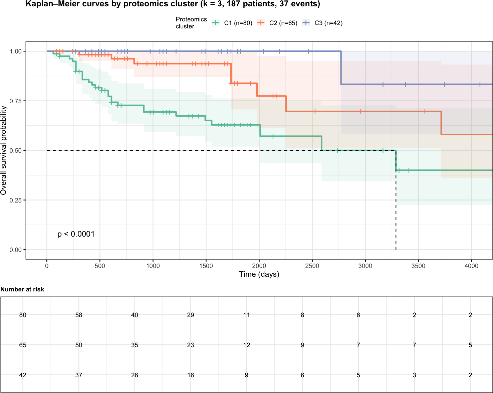

``` r
km_fit_months <- survfit(Surv(os_months, os_event) ~ cluster, data = surv_data)
summary(km_fit_months)$table[, c("records", "events", "median", "0.95LCL", "0.95UCL")]
```

    ##            records events median 0.95LCL 0.95UCL
    ## cluster=C1      80     28    108      66      NA
    ## cluster=C2      65      8     NA     122      NA
    ## cluster=C3      42      1     NA      NA      NA

------------------------------------------------------------------------

## 11. Cox Proportional Hazards Model

The KM curves answer “are the clusters different?”. The Cox model
answers the next question: is that difference still there after we
adjust for what we already knew about the patient? If `cluster` retains
a significant hazard ratio after adjustment, the proteomic structure is
contributing risk information beyond clinical baseline.

In this version the clinical baseline is no longer just age + sex. We
add WHO grade, extent of resection, treatment received (radiation,
chemotherapy), and the canonical pediatric brain tumour driver flags
(`braf_status`, `h3f3a_ctnnb1_status`, etc.). Beating this baseline is a
much more meaningful demonstration that proteomics adds prognostic
information than beating age + sex alone.

``` r
# Assemble extended clinical covariates. Some columns may have very sparse
# coverage in this cohort, we collapse the driver flags into a single
# binary "any_known_driver" column to keep the model identifiable.
cox_data <- surv_data |>
  mutate(
    any_known_driver = factor(
      pmax(
        as.integer(str_detect(toupper(braf_status), "MUT|POS|YES|TRUE")),
        as.integer(str_detect(toupper(h3f3a_ctnnb1_status), "MUT|POS|YES|TRUE")),
        as.integer(str_detect(toupper(ependymoma_rela_status), "MUT|POS|YES|TRUE|FUS")),
        as.integer(str_detect(toupper(hgg_h3f3a_status), "MUT|POS|YES|TRUE")),
        as.integer(str_detect(toupper(lgg_braf_status), "MUT|POS|YES|TRUE")),
        as.integer(str_detect(toupper(ctnnb1_status), "MUT|POS|YES|TRUE")),
        na.rm = TRUE),
      levels = c(0, 1), labels = c("None", "AnyDriver")),
    grade_bin = factor(
      ifelse(as.character(grade) %in% c("III", "III/IV", "IV"),
             "HighGrade", "LowGrade"),
      levels = c("LowGrade", "HighGrade"))) |>
  filter(!is.na(age))

cat(sprintf("Cox model: %d patients (%d events), %d clusters\n",
            nrow(cox_data), sum(cox_data$os_event), nlevels(cox_data$cluster)))
```

    ## Cox model: 187 patients (37 events), 3 clusters

``` r
# Extended-baseline Cox model: clinical covariates + cluster
# Note: we use the binary high/low grade collapse rather than the full
# ordered factor, because some grade levels have very few events and
# inflate standard errors otherwise.
cox_fit <- coxph(
  Surv(os_days, os_event) ~ cluster + age + sex + grade_bin +
                            extent_resection + radiation_yn +
                            chemotherapy_yn + any_known_driver,
  data = cox_data)

# Tidy coefficient table
coef_tbl <- summary(cox_fit)$coefficients |>
  as.data.frame() |>
  rownames_to_column("term") |>
  select(term, coef, `exp(coef)`, `se(coef)`, z, `Pr(>|z|)`) |>
  rename(log_HR = coef, HR = `exp(coef)`,
         SE = `se(coef)`, z_score = z, p_value = `Pr(>|z|)`) |>
  mutate(
    sig = case_when(p_value < 0.001 ~ "***",
                    p_value < 0.01  ~ "**",
                    p_value < 0.05  ~ "*",
                    TRUE ~ ""),
    across(c(log_HR, HR, SE, z_score), ~ round(., 3)),
    p_value = formatC(p_value, format = "g", digits = 3))
cat("\nCox model coefficients (extended baseline)\n"); print(coef_tbl, row.names = FALSE)
```

    ## 
    ## Cox model coefficients (extended baseline)

    ##                                        term log_HR     HR    SE z_score
    ##                                   clusterC2  0.006  1.006 0.489   0.013
    ##                                   clusterC3 -1.328  0.265 1.142  -1.163
    ##                                         age  0.000  1.000 0.000   0.750
    ##                                     sexMale -0.218  0.804 0.370  -0.589
    ##                          grade_binHighGrade  2.641 14.028 0.700   3.772
    ##  extent_resectionGross/Near total resection -1.348  0.260 0.975  -1.382
    ##                         extent_resectionN/A     NA     NA 0.000      NA
    ##              extent_resectionNot Applicable -1.213  0.297 1.093  -1.110
    ##           extent_resectionPartial resection -0.715  0.489 0.930  -0.769
    ##                             radiation_ynYes -0.624  0.536 0.524  -1.192
    ##                          chemotherapy_ynYes -0.131  0.877 0.410  -0.320
    ##                   any_known_driverAnyDriver -0.636  0.530 0.804  -0.791
    ##   p_value sig
    ##      0.99    
    ##     0.245    
    ##     0.453    
    ##     0.556    
    ##  0.000162 ***
    ##     0.167    
    ##        NA    
    ##     0.267    
    ##     0.442    
    ##     0.233    
    ##     0.749    
    ##     0.429

``` r
# Global model performance
s <- summary(cox_fit)
perf_tbl <- tibble(
  Metric = c("Concordance (Harrell's C)", "Concordance SE",
             "Likelihood ratio test (χ²)", "LRT p-value",
             "Wald test (χ²)", "Wald p-value",
             "Score (log-rank) test (χ²)", "Score p-value",
             "AIC", "n (complete cases)", "Events"),
  Value = c(
    round(s$concordance["C"], 3),
    round(s$concordance["se(C)"], 3),
    round(s$logtest["test"], 3), formatC(s$logtest["pvalue"], format = "g", digits = 3),
    round(s$waldtest["test"], 3), formatC(s$waldtest["pvalue"], format = "g", digits = 3),
    round(s$sctest["test"], 3), formatC(s$sctest["pvalue"], format = "g", digits = 3),
    round(AIC(cox_fit), 1),
    as.character(s$n),
    as.character(s$nevent)))
print(perf_tbl, row.names = FALSE)
```

    ## # A tibble: 11 × 2
    ##    Metric                     Value   
    ##    <chr>                      <chr>   
    ##  1 Concordance (Harrell's C)  0.87    
    ##  2 Concordance SE             0.024   
    ##  3 Likelihood ratio test (χ²) 62.996  
    ##  4 LRT p-value                2.56e-09
    ##  5 Wald test (χ²)             41.25   
    ##  6 Wald p-value               2.18e-05
    ##  7 Score (log-rank) test (χ²) 76.319  
    ##  8 Score p-value              7.56e-12
    ##  9 AIC                        283.2   
    ## 10 n (complete cases)         184     
    ## 11 Events                     36

**Interpreting the Cox output:**

- HR \> 1 = higher hazard (worse survival) relative to the reference
  level.
- HR \< 1 = lower hazard (better survival).
- A small cluster with very few events (the Hauck–Donner /
  complete-separation case) will produce HR estimates with extreme SEs
  that should be ignored; the concordance statistic is the trustworthy
  global summary.
- A cluster effect surviving adjustment for the extended clinical
  baseline is the descriptive evidence that the proteomic stratification
  is prognostically informative beyond standard-of-care variables. We
  deliberately stop at description and do not build a per-patient
  predictive risk score on this cohort, with only ≈ 36 OS events the
  events-per-parameter ratio is too low to support an honest predictive
  claim. The §14 therapeutic-vulnerability arm and the §15 molecular
  classifier sidestep this small-event problem by addressing different
  questions.

------------------------------------------------------------------------

## 12. Differential Protein Expression (limma one-vs-rest)

We identify proteins significantly up-regulated in each cluster relative
to all other clusters combined. These become the molecular fingerprints
of each subtype, and they also seed candidate cluster-marker shortlists
used by the §14 therapeutic-target panel.

`limma` is well-validated for mass-spectrometry proteomics data
(continuous, approximately normal after z-scoring) and handles the
moderate sample sizes of this dataset well.

``` r
common_samples <- base::intersect(rownames(prot_imputed), names(cluster_labels))
prot_cl <- prot_imputed[common_samples, ]
cl_vec  <- cluster_labels[common_samples]

top_markers_all <- list()
for (cl in sort(unique(cl_vec))) {
  group <- ifelse(cl_vec == cl, "Target", "Other")
  design_mat <- model.matrix(~ 0 + factor(group))
  colnames(design_mat) <- c("Other", "Target")
  contrast_mat <- makeContrasts(Target - Other, levels = design_mat)

  fit_de <- lmFit(t(prot_cl), design_mat)
  fit_c <- contrasts.fit(fit_de, contrast_mat)
  fit_eb <- eBayes(fit_c)
  top_tbl <- topTable(fit_eb, coef = 1, n = 20,
                       sort.by = "B", adjust.method = "BH")
  top_markers_all[[as.character(cl)]] <- rownames(top_tbl)}
all_markers <- unique(unlist(top_markers_all))
length(all_markers)
```

    ## [1] 60

``` r
marker_cluster <- stack(top_markers_all) |>
  rename(protein = values, source_cluster = ind) |>
  distinct(protein, .keep_all = TRUE)

marker_ann <- data.frame(
  row.names = all_markers,
  marker_of = paste0("C", marker_cluster$source_cluster[
                    match(all_markers, marker_cluster$protein)]))

marker_ann_pal <- setNames(
  brewer.pal(max(BEST_K, 3), "Set2")[seq_len(BEST_K)],
  paste0("C", sort(unique(cl_vec))))

prot_z <- t(scale(t(prot_cl[, all_markers])))
prot_z <- pmax(prot_z, -3); prot_z <- pmin(prot_z, 3)

col_order <- order(cl_vec)
prot_z_ord <- prot_z[col_order, ]
col_ann <- data.frame(row.names = names(cl_vec)[col_order],
                          cluster   = paste0("C", cl_vec[col_order]))

pheatmap(
  t(prot_z_ord),
  annotation_col = col_ann,
  annotation_row = marker_ann,
  annotation_colors = list(cluster = marker_ann_pal,
                           marker_of = marker_ann_pal),
  color = colorRampPalette(rev(brewer.pal(11, "RdBu")))(100),
  breaks = seq(-3, 3, length.out = 101),
  cluster_rows = FALSE, cluster_cols = FALSE,
  show_colnames = FALSE, show_rownames = FALSE,
  fontsize_row = 6.5, treeheight_row = 40,
  border_color = NA,
  main = sprintf(
    "Top differential proteins per cluster  (k = %d, limma one-vs-rest)\nExpression as z-score (row-normalised); capped at ±3 SD",
    BEST_K),
  fontsize = 9,
  legend_breaks = c(-3, -1.5, 0, 1.5, 3),
  legend_labels = c("−3 SD\n(low)", "−1.5", "0", "+1.5", "+3 SD\n(high)")
)
```

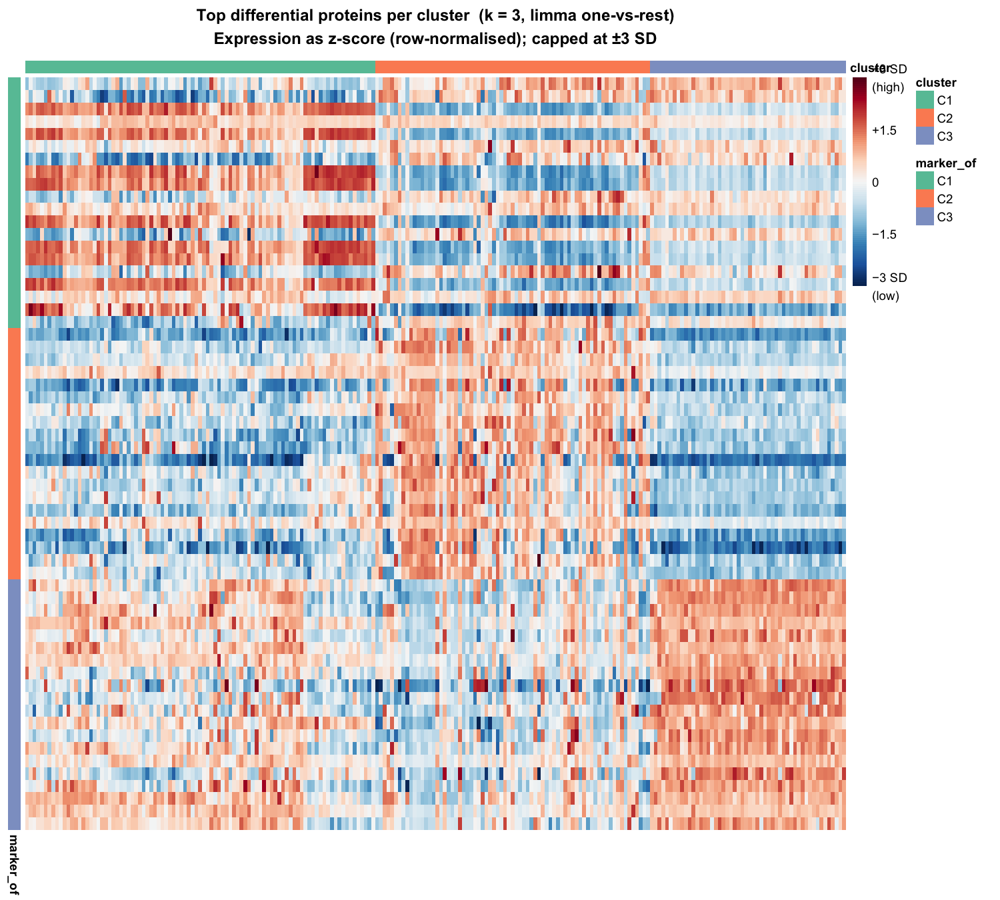

``` r
cat("Top 10 upregulated marker proteins per cluster:\n")
```

    ## Top 10 upregulated marker proteins per cluster:

``` r
for (cl in names(top_markers_all)) {
  cat(sprintf("\n  Cluster %s: %s\n", cl,
              paste(top_markers_all[[cl]][1:10], collapse = ", ")))}
```

    ## 
    ##   Cluster 1: SEPT8, NCAM2, SON, ARHGAP39, RBM25, RCAN1, HSPA12A, ACIN1, PRPF40A, TMOD2
    ## 
    ##   Cluster 2: IGSF8, LYNX1, PPP3CA, MDH1, TUBB4A, GNAO1, ADAM22, CNTNAP1, PHYHIP, NFASC
    ## 
    ##   Cluster 3: HIP1, LRP1, PHLDB1, SLC12A9, CC2D1A, SNX1, SLC9A7, NLGN1, CSPG4, SPRED1

------------------------------------------------------------------------

## 13. Random Forest (classification by histology)

These two ensemble models give a model-free, descriptive ranking of
which individual proteins carry the strongest signal, first against
histological subtype (Random Forest classifier) and then against OS
event timing (Random Survival Forest). They do not produce a per-patient
risk score; their role is to surface candidate proteins that
subsequently feed into the cluster-marker tables in §14.

``` r
rf_fit <- randomForest(x = prot_imputed,
                       y = Y,
                       ntree = 500,
                       importance = TRUE)
varImpPlot(rf_fit, n.var = 25,
           main = "Top 25 proteins by Random Forest importance (histology classification)",
           cex = 0.85)
```

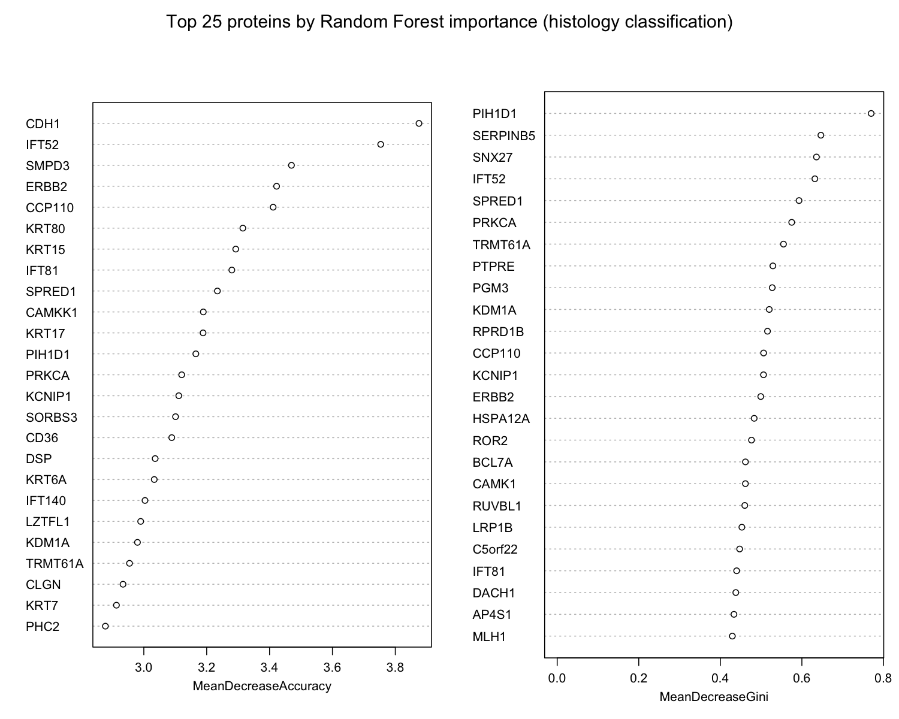

------------------------------------------------------------------------

## 14. Therapeutic Target Discovery

This section is the precision-oncology deliverable. For each NMF cluster
identified in §7, we build a per-cluster panel of candidate therapeutic
targets supported by multiple, independent lines of evidence:
cluster-specific overexpression (limma; pulled from §12), inferred
kinase activity (KSEA on per-cluster phospho contrasts, substrates from
OmniPath), brain cell-line dependency (DepMap CRISPR essentiality), and
druggability (OpenTargets clinical-trial / approved-drug lookup). A
target that scores well on at least two of these is a defensible
candidate for a subtype-specific therapy panel.

### 14.1 Per-cluster phosphosite contrasts (limma)

Phospho rows in CPTAC follow `<GENE>_<start>_<end>_<x>_<y>_<RES><pos>`,
e.g. `ALAD_214_215_1_1_S215`. We parse those into (gene, residue type,
position) so we can join phosphosites to OmniPath kinase–substrate
entries.

``` r
# Parse CPTAC phospho IDs into (gene, residue type, position)
parse_phospho_id <- function(ids) {
  m <- str_match(ids, "^([A-Z0-9]+)_\\d+_\\d+_\\d+_\\d+_([STY])(\\d+)$")
  tibble(
    phosphosite = ids,
    gene_symbol = m[, 2],
    residue_type = m[, 3],
    residue_offset = as.integer(m[, 4]))
}
phos_meta <- parse_phospho_id(colnames(phos_imputed))
parse_ok <- mean(!is.na(phos_meta$gene_symbol))
cat(sprintf("Phospho ID parser: %.1f%% of %d sites parsed cleanly\n",
            100 * parse_ok, nrow(phos_meta)))
```

    ## Phospho ID parser: 89.4% of 4548 sites parsed cleanly

``` r
ggplot(phos_meta |> filter(!is.na(residue_type)),
       aes(x = residue_type)) +
  geom_bar(fill = "#4E79A7", colour = "white") +
  labs(title = "Phosphosite residue distribution after parsing CPTAC IDs",
       x = "Phosphorylated residue (Ser / Thr / Tyr)",
       y = "Number of phosphosites") +
  theme_bw(base_size = 12)
```

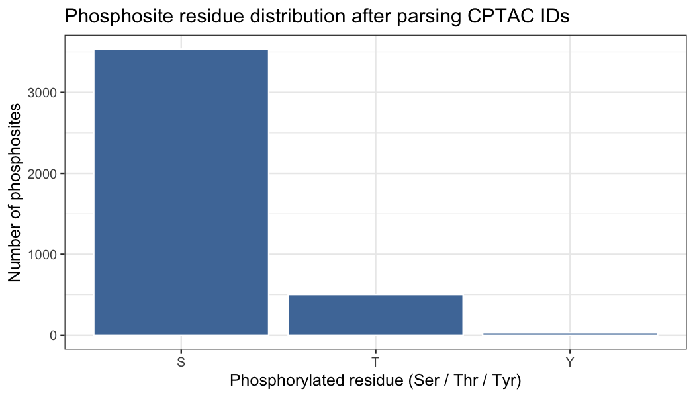

``` r
# One-vs-rest limma per cluster on the phosphoproteome
phos_common <- base::intersect(rownames(phos_imputed), names(cluster_labels))
phos_cl <- phos_imputed[phos_common, ]
cl_vec_phos <- cluster_labels[phos_common]
cat(sprintf("Phospho one-vs-rest contrasts on %d samples × %d phosphosites\n",
            nrow(phos_cl), ncol(phos_cl)))
```

    ## Phospho one-vs-rest contrasts on 217 samples × 4548 phosphosites

``` r
phos_de_by_cluster <- list()
for (cl in sort(unique(cl_vec_phos))) {
  group <- ifelse(cl_vec_phos == cl, "Target", "Other")
  design_mat <- model.matrix(~ 0 + factor(group))
  colnames(design_mat) <- c("Other", "Target")
  contrast_mat <- makeContrasts(Target - Other, levels = design_mat)
  fit_de <- lmFit(t(phos_cl), design_mat)
  fit_c <- contrasts.fit(fit_de, contrast_mat)
  fit_eb <- eBayes(fit_c)
  tt <- topTable(fit_eb, coef = 1, number = Inf, sort.by = "none",
                 adjust.method = "BH")
  tt$phosphosite <- rownames(tt)
  tt$cluster <- paste0("C", cl)
  phos_de_by_cluster[[paste0("C", cl)]] <- as_tibble(tt)
}
phos_de_long <- bind_rows(phos_de_by_cluster) |>
  rename(logFC_phos = logFC, q = adj.P.Val) |>
  inner_join(phos_meta, by = "phosphosite") |>
  select(cluster, phosphosite, gene_symbol, residue_type, residue_offset,
         logFC_phos, P.Value, q)
cat("Phospho DE table:", nrow(phos_de_long), "rows\n")
```

    ## Phospho DE table: 13644 rows

``` r
print(head(phos_de_long, 5))
```

    ## # A tibble: 5 × 8
    ##   cluster phosphosite         gene_symbol residue_type residue_offset logFC_phos
    ##   <chr>   <chr>               <chr>       <chr>                 <int>      <dbl>
    ## 1 C1      ALAD_214_215_1_1_S… ALAD        S                       215    -0.538 
    ## 2 C1      ALDOA_36_39_1_1_S36 ALDOA       S                        36    -1.04  
    ## 3 C1      ALDOA_36_39_1_1_S39 ALDOA       S                        39    -0.866 
    ## 4 C1      ALDOA_46_52_1_1_S46 ALDOA       S                        46    -0.0574
    ## 5 C1      ANK1_1684_1693_1_1… ANK1        S                      1686    -0.104 
    ## # ℹ 2 more variables: P.Value <dbl>, q <dbl>

### 14.2 Kinase activity per cluster (KSEA)

KSEA assigns each kinase a z-score per cluster from the mean log
fold-change of its known phospho substrates relative to background.
Substrates come from OmniPath, which aggregates PhosphoSitePlus, Signor,
and others. Kinases with fewer than `KSEA_MIN_SUBSTRATES` matched
substrates are dropped to avoid noisy estimates.

``` r
cache_file <- "./Data/omnipath_enzsub_human.csv"

if (file.exists(cache_file)) {
  enzsub <- read.csv(cache_file)
} else if (have_OmnipathR) {
  enzsub <- tryCatch(
    OmnipathR::omnipath_query(query_type = "enzsub", organism = 9606, format = "data.frame"),
    error = function(e) { message("OmniPath fetch failed: ", e$message); NULL })
  if (!is.null(enzsub)) write.csv(enzsub, cache_file, row.names = FALSE)}

if (!is.null(enzsub)) {
  ks_table <- enzsub |>
    transmute(kinase = enzyme_genesymbol,
              substrate_gene = substrate_genesymbol,
              residue_type = residue_type,
              residue_offset = as.integer(residue_offset)) |>
    filter(!is.na(kinase), !is.na(substrate_gene),
           residue_type %in% c("S", "T", "Y"),
           !is.na(residue_offset)) |>
    distinct()
  cat("OmniPath kinase–substrate entries (S/T/Y phosphorylation):",
      nrow(ks_table), "\n")

  # Coverage check: how many of our phosphosites map to OmniPath?
  cov_check <- phos_meta |>
    filter(!is.na(gene_symbol)) |>
    inner_join(ks_table,
               by = c("gene_symbol" = "substrate_gene",
                      "residue_type" = "residue_type",
                      "residue_offset" = "residue_offset")) |>
    distinct(phosphosite)
  cat(sprintf("Phosphosites with at least one OmniPath kinase: %d / %d (%.1f%%)\n",
              nrow(cov_check), nrow(phos_meta),
              100 * nrow(cov_check) / nrow(phos_meta)))

  # KSEA per cluster
  ksea_one_cluster <- function(de_tbl, ks_table, min_subs) {
    mu <- mean(de_tbl$logFC_phos, na.rm = TRUE)
    sigma <- sd(de_tbl$logFC_phos, na.rm = TRUE)
    de_tbl |>
      inner_join(ks_table,
                 by = c("gene_symbol" = "substrate_gene",
                        "residue_type" = "residue_type",
                        "residue_offset" = "residue_offset")) |>
      group_by(kinase) |>
      summarise(n_substrates = n(),
                mean_logFC   = mean(logFC_phos, na.rm = TRUE),
                .groups = "drop") |>
      filter(n_substrates >= min_subs) |>
      mutate(ksea_z = (mean_logFC - mu) * sqrt(n_substrates) / sigma,
             p = 2 * pnorm(-abs(ksea_z)),
             q = p.adjust(p, method = "BH"))}

  ksea_all <- phos_de_long |>
    group_by(cluster) |>
    group_modify(~ ksea_one_cluster(.x, ks_table, KSEA_MIN_SUBSTRATES)) |>
    ungroup()
  cat("KSEA results:", nrow(ksea_all), "kinase × cluster rows\n")

  # Heatmap of top kinases per cluster
  top_kinases <- ksea_all |>
    group_by(cluster) |>
    slice_max(abs(ksea_z), n = 10, with_ties = FALSE) |>
    pull(kinase) |> unique()
  ksea_mat <- ksea_all |>
    filter(kinase %in% top_kinases) |>
    select(cluster, kinase, ksea_z) |>
    pivot_wider(names_from = cluster, values_from = ksea_z, values_fill = 0) |>
    column_to_rownames("kinase") |>
    as.matrix()
  rng <- max(abs(ksea_mat))
  pheatmap(
    ksea_mat,
    color = colorRampPalette(rev(brewer.pal(11, "RdBu")))(100),
    breaks = seq(-rng, rng, length.out = 101),
    cluster_rows = TRUE, cluster_cols = TRUE,
    fontsize_row = 8, fontsize_col = 10,
    border_color = NA,
    main = "Kinase activity z-score per cluster (KSEA, top 10 kinases per cluster)",
    legend_breaks = c(-rng, -rng/2, 0, rng/2, rng),
    legend_labels = c(sprintf("%.1f\n(down)", -rng),
                      sprintf("%.1f", -rng/2), "0",
                      sprintf("%.1f", rng/2),
                      sprintf("%.1f\n(up)", rng)))
} else {
  ksea_all <- tibble(cluster = character(), kinase = character(),
                     ksea_z = double(), q = double(),
                     n_substrates = integer())
}
```

    ## OmniPath kinase–substrate entries (S/T/Y phosphorylation): 39391

    ## Phosphosites with at least one OmniPath kinase: 659 / 4548 (14.5%)

    ## KSEA results: 258 kinase × cluster rows

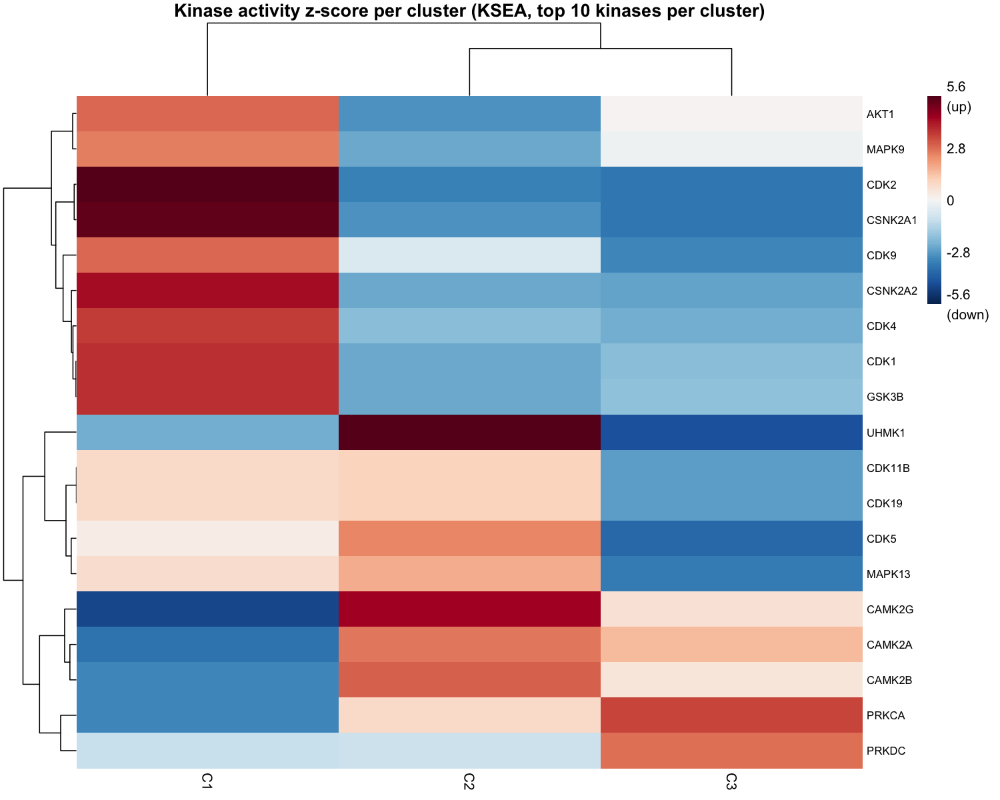

### 14.3 Cluster-marker shortlist (overexpressed proteins)

Re-run the §12 limma machinery to recover the full statistics table per
cluster (not just the top-20 names), then filter to genes that are
up-regulated only, these are candidates for inhibition.

``` r
# Per-cluster limma DE: full table this time, so we can apply our own thresholds.
prot_de_full <- list()
for (cl in sort(unique(cl_vec))) {
  group <- ifelse(cl_vec == cl, "Target", "Other")
  design_mat <- model.matrix(~ 0 + factor(group))
  colnames(design_mat) <- c("Other", "Target")
  contrast_mat <- makeContrasts(Target - Other, levels = design_mat)
  fit_de <- lmFit(t(prot_cl), design_mat)
  fit_c <- contrasts.fit(fit_de, contrast_mat)
  fit_eb <- eBayes(fit_c)
  tt <- topTable(fit_eb, coef = 1, number = Inf, sort.by = "none",
                 adjust.method = "BH")
  tt$gene <- rownames(tt)
  tt$cluster <- paste0("C", cl)
  prot_de_full[[paste0("C", cl)]] <- as_tibble(tt)
}
prot_de_full <- bind_rows(prot_de_full) |>
  rename(q = adj.P.Val) |>
  select(cluster, gene, logFC, P.Value, q)

marker_panel <- prot_de_full |>
  filter(q < 0.05, logFC > 0.5) |>
  arrange(cluster, q) |>
  group_by(cluster) |>
  slice_head(n = 50) |> # cap candidate list per cluster
  ungroup()
cat("Cluster marker shortlist:", nrow(marker_panel),
    "rows across", n_distinct(marker_panel$cluster), "clusters\n")
```

    ## Cluster marker shortlist: 150 rows across 3 clusters

``` r
print(marker_panel |> count(cluster, name = "n_candidates"))
```

    ## # A tibble: 3 × 2
    ##   cluster n_candidates
    ##   <chr>          <int>
    ## 1 C1                50
    ## 2 C2                50
    ## 3 C3                50

### 14.4 DepMap brain-line dependency

Cross-reference the cluster-marker shortlist with CRISPR essentiality
scores from DepMap, restricted to brain/CNS cell lines. A gene that is
both upregulated in a cluster AND broadly essential in brain lines is a
strong candidate for therapeutic inhibition.

``` r
# Local DepMap files downloaded from https://depmap.org/portal/download/all/
# CRISPRGeneEffect.csv: Chronos gene effect scores (cell lines × genes)
# Model.csv: cell line metadata (ModelID, OncotreeLineage, OncotreePrimaryDisease)
DEPMAP_CRISPR <- "./data/CRISPRGeneEffect.csv"
DEPMAP_MODEL <- "./data/Model.csv"

cat("Loading DepMap files...\n")
```

    ## Loading DepMap files...

``` r
# Model.csv has ModelID as first column; filter to brain/CNS lines
model <- readr::read_csv(DEPMAP_MODEL, show_col_types = FALSE)
brain_lines <- model |>
  filter(OncotreeLineage == "CNS/Brain" |
           str_detect(toupper(OncotreePrimaryDisease), "BRAIN|GLIOMA|GLIOBLASTOMA|MEDULLOBLASTOMA|EPENDYMOMA")) |>
  pull(ModelID) |> unique()
cat("Brain/CNS DepMap cell lines:", length(brain_lines), "\n")
```

    ## Brain/CNS DepMap cell lines: 127

``` r
# CRISPRGeneEffect.csv: rows = cell lines (ModelID), columns = "GENESYMBOL (ENTREZID)"
# Read and pivot to long format for summarisation
crispr_wide <- readr::read_csv(DEPMAP_CRISPR, show_col_types = FALSE)

# First column is the ModelID
model_id_col <- colnames(crispr_wide)[1]

dep_long <- crispr_wide |>
  filter(.data[[model_id_col]] %in% brain_lines) |>
  pivot_longer(-all_of(model_id_col),
               names_to = "gene_raw", values_to = "dependency") |>
  rename(model_id = all_of(model_id_col)) |>
  # Strip Entrez suffix: "PCNA (5111)" -> "PCNA"
  mutate(gene_name = str_remove(gene_raw, " \\(\\d+\\)$")) |>
  filter(!is.na(dependency))

dep_summary <- dep_long |>
  group_by(gene_name) |>
  summarise(mean_ess = mean(dependency, na.rm = TRUE),
            q25_ess = quantile(dependency, 0.25, na.rm = TRUE),
            n_lines = n_distinct(model_id), .groups = "drop") |>
  mutate(essential = mean_ess < DEPMAP_ESS_THRESH)

cat(sprintf("dep_summary: %d genes across %d brain lines\n",
            nrow(dep_summary), length(brain_lines)))
```

    ## dep_summary: 18435 genes across 127 brain lines

``` r
# Diagnostic: how many marker genes are in DepMap?
overlap <- base::intersect(marker_panel$gene, dep_summary$gene_name)
cat(sprintf("Gene overlap: %d / %d marker genes found in DepMap\n",
            length(overlap), n_distinct(marker_panel$gene)))
```

    ## Gene overlap: 149 / 150 marker genes found in DepMap

``` r
dependency_table <- marker_panel |>
  left_join(dep_summary, by = c("gene" = "gene_name")) |>
  mutate(dep_flag = !is.na(mean_ess) & essential)

cat(sprintf("Marker genes with DepMap entry: %d / %d (%.1f%%)\n",
            sum(!is.na(dependency_table$mean_ess)), nrow(dependency_table),
            100 * mean(!is.na(dependency_table$mean_ess))))
```

    ## Marker genes with DepMap entry: 149 / 150 (99.3%)

``` r
cat(sprintf("Cluster-marker x DepMap-essential overlaps: %d\n",
            sum(dependency_table$dep_flag, na.rm = TRUE)))
```

    ## Cluster-marker x DepMap-essential overlaps: 34

``` r
dependency_table |>
  filter(!is.na(mean_ess)) |>
  ggplot(aes(x = cluster, y = mean_ess, fill = cluster)) +
  geom_violin(alpha = 0.8, colour = "white") +
  geom_jitter(width = 0.18, size = 1, alpha = 0.5, colour = "grey25") +
  geom_hline(yintercept = DEPMAP_ESS_THRESH, linetype = "dashed",
             colour = "firebrick", linewidth = 0.7) +
  scale_fill_brewer(palette = "Set2", guide = "none") +
  labs(title = "Brain-line CRISPR dependency of cluster-marker genes",
       subtitle = sprintf("Below dashed line (%.1f) = broadly essential in brain/CNS lines",
                          DEPMAP_ESS_THRESH),
       x = "Proteomics cluster",
       y = "Mean DepMap essentiality across brain/CNS lines") +
  theme_bw(base_size = 12)
```

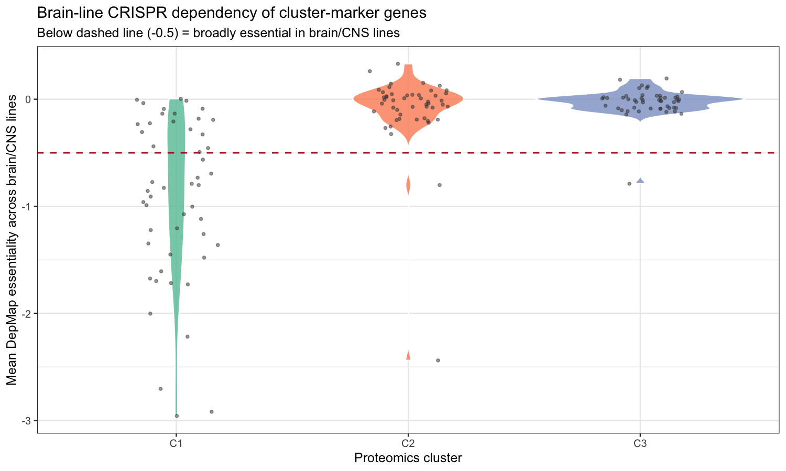

### 14.5 Druggability annotation (OpenTargets)

Cross-reference candidate genes with OpenTargets to flag which already
have approved or clinical-trial drugs.

``` r
# Genes to exclude from druggability: pan-cytoskeletal or broadly expressed
# proteins whose drugs are non-specific chemotherapy, not precision targets.
DRUGGABILITY_EXCLUDE <- c("TUBB4A", "TUBB2A", "TUBA4A", "TUBB3", "TUBA1A", "ACTB", "ACTG1")

# Top active kinases per cluster from KSEA
ksea_candidates <- ksea_all |>
  filter(ksea_z > 1.5, n_substrates >= KSEA_MIN_SUBSTRATES) |>
  group_by(cluster) |>
  slice_max(ksea_z, n = 10) |>
  ungroup() |>
  pull(kinase) |> unique()

panel_candidates <- dependency_table |>
  filter(q < 0.05, logFC > 0.5) |>
  filter(!gene %in% DRUGGABILITY_EXCLUDE) |>
  group_by(cluster) |>
  slice_max(logFC + abs(coalesce(mean_ess, 0)), n = 30, with_ties = FALSE) |>
  ungroup() |>
  pull(gene) |> unique()

# Combine with KSEA with expression-based candidates
panel_candidates <- union(panel_candidates, ksea_candidates)

cat("Candidate genes for druggability lookup:", length(panel_candidates), "\n")
```

    ## Candidate genes for druggability lookup: 114

``` r
CT_FILE <- "./data/clinical_target_compact.csv"
# Read the local OpenTargets file
clinical_target <- readr::read_csv(CT_FILE, show_col_types = FALSE)

gene_map <- AnnotationDbi::select(
  org.Hs.eg.db::org.Hs.eg.db,
  keys = panel_candidates,
  columns = "ENSEMBL",
  keytype = "SYMBOL" ) |>
  rename(gene_symbol = SYMBOL, ensembl_id = ENSEMBL) |>
  filter(!is.na(ensembl_id))
cat("Symbols mapped to Ensembl IDs:", nrow(gene_map), "/",
    length(panel_candidates), "\n")
```

    ## Symbols mapped to Ensembl IDs: 118 / 114

``` r
phase_levels <- c(
  "PHASE1" = 1, "PHASE2" = 2, "PHASE3" = 3, "PHASE4" = 4, "APPROVAL" = 4)

# Join to get CHEMBL IDs and phase, still no human-readable names yet
druggable_raw <- gene_map |>
  inner_join(clinical_target, by = c("ensembl_id" = "targetId")) |>
  mutate(max_phase = as.numeric(phase_levels[maxClinicalStage])) |>
  filter(!is.na(max_phase), max_phase >= DRUGGABILITY_PHASE) |>
  rename(gene = gene_symbol, chembl_id = drugId) |>
  filter(!gene %in% DRUGGABILITY_EXCLUDE) |> # remove non-specific targets
  select(gene, chembl_id, max_phase)

cat("Druggable hits (raw CHEMBL IDs):", nrow(druggable_raw), "\n")
```

    ## Druggable hits (raw CHEMBL IDs): 23

``` r
# Resolve CHEMBL IDs -> drug names via the ChEMBL REST API.
# We only query the unique CHEMBL IDs (not one per gene-drug row) to
# minimise requests. Each call hits: https://www.ebi.ac.uk/chembl/api/data/molecule/<ID>
# Returns JSON with pref_name. Wrapped in tryCatch so a network failure
# just leaves the name as NA and the rest of the chunk continues.
resolve_chembl_name <- function(chembl_id) {
  if (!have_httr2) return(NA_character_)
  tryCatch({
    resp <- httr2::request(
      paste0("https://www.ebi.ac.uk/chembl/api/data/molecule/", chembl_id,
             "?format=json")) |>
      httr2::req_timeout(6) |>
      httr2::req_perform()
    parsed <- jsonlite::fromJSON(httr2::resp_body_string(resp))
    # pref_name is the WHO INN or best available name; fall back to chembl_id
    name <- parsed$pref_name
    if (is.null(name) || is.na(name) || name == "") chembl_id else name
  }, error = function(e) NA_character_)
}

unique_ids <- unique(druggable_raw$chembl_id)
cat("Resolving", length(unique_ids), "unique CHEMBL IDs to drug names...\n")
```

    ## Resolving 21 unique CHEMBL IDs to drug names...

``` r
name_map <- tibble(
  chembl_id = unique_ids,
  drug_name = vapply(unique_ids, resolve_chembl_name, character(1)))
cat(sprintf("Names resolved: %d / %d\n",
            sum(!is.na(name_map$drug_name)), length(unique_ids)))
```

    ## Names resolved: 21 / 21

``` r
druggable_table <- druggable_raw |>
  left_join(name_map, by = "chembl_id") |>
  # Fall back to chembl_id if name resolution failed
  mutate(drug_name = coalesce(drug_name, chembl_id)) |>
  select(gene, drug_name, chembl_id, max_phase)

cat("Druggable hits returned:", nrow(druggable_table), "\n")
```

    ## Druggable hits returned: 23

``` r
if (nrow(druggable_table) > 0) print(head(druggable_table, 30))
```

    ##      gene                         drug_name     chembl_id max_phase
    ## 1    NPM1                        CRIZOTINIB  CHEMBL601719         4
    ## 2    NPM1                         CERITINIB CHEMBL2403108         4
    ## 3   PRKCG                       MIDOSTAURIN  CHEMBL608533         4
    ## 4   ITGAV                         ABCIXIMAB CHEMBL1201584         4
    ## 5  IL1RAP                        SPESOLIMAB CHEMBL4297911         4
    ## 6   GRIK3                        TOPIRAMATE  CHEMBL220492         4
    ## 7   GSK3B                 LITHIUM CARBONATE CHEMBL1200826         4
    ## 8   GSK3B                   LITHIUM CITRATE CHEMBL2103738         4
    ## 9    CDK4                       PALBOCICLIB  CHEMBL189963         4
    ## 10   CDK4              RIBOCICLIB SUCCINATE CHEMBL3707266         4
    ## 11   CDK4                       ABEMACICLIB CHEMBL3301610         4
    ## 12   CDK4                       TRILACICLIB CHEMBL3894860         4
    ## 13   CDK4       TRILACICLIB DIHYDROCHLORIDE CHEMBL4650272         4
    ## 14   AKT1                      CAPIVASERTIB CHEMBL2325741         4
    ## 15  ROCK1 RIPASUDIL HYDROCHLORIDE DIHYDRATE CHEMBL4594454         4
    ## 16  ROCK1             NETARSUDIL DIMESYLATE CHEMBL4594251         4
    ## 17  ROCK1                           FASUDIL   CHEMBL38380         4
    ## 18  ROCK1                        NETARSUDIL CHEMBL4594250         4
    ## 19  ROCK1                       BELUMOSUDIL CHEMBL2005186         4
    ## 20  ROCK1              BELUMOSUDIL MESYLATE CHEMBL4802130         4
    ## 21  ROCK1                         RIPASUDIL CHEMBL3426621         4
    ## 22  PRKCA                       MIDOSTAURIN  CHEMBL608533         4
    ## 23  PRKCD                       MIDOSTAURIN  CHEMBL608533         4

### 14.6 Integrated per-cluster therapeutic panel

Combine the four evidence streams into a single ranked panel per
cluster. The composite score is a sum of standardised components (each
missing stream contributes 0), keeping the ranking robust when
individual data sources are unavailable.

``` r
panel <- dependency_table |>
  mutate(z_overexp = as.numeric(scale(logFC))) |>
  mutate(z_essent = ifelse(is.na(mean_ess), 0,
                            as.numeric(-scale(mean_ess)))) |>
  left_join(
    ksea_all |>
      transmute(cluster, gene = kinase,
                z_kinase = as.numeric(scale(ksea_z))),
    by = c("cluster", "gene")) |>
  mutate(z_kinase = ifelse(is.na(z_kinase), 0, z_kinase)) |>
  left_join(
    druggable_table |>
      group_by(gene) |>
      summarise(top_drug = first(drug_name),
                max_phase = suppressWarnings(max(max_phase, na.rm = TRUE)),
                .groups = "drop") |>
      mutate(max_phase = ifelse(is.infinite(max_phase), NA_real_, max_phase)),
    by = "gene") |>
  mutate(z_drug = ifelse(is.na(max_phase), 0, log10(max_phase + 1)),
         panel_score = z_overexp + z_essent + z_kinase + z_drug) |>
  group_by(cluster) |>
  arrange(desc(panel_score), .by_group = TRUE) |>
  slice_head(n = 10) |>
  ungroup()

cat("Final panel rows:", nrow(panel),
    "across", n_distinct(panel$cluster), "clusters\n")
```

    ## Final panel rows: 30 across 3 clusters

``` r
panel |>
  mutate(gene = forcats::fct_inorder(gene)) |>
  ggplot(aes(x = cluster, y = gene)) +
  geom_point(aes(size = -log10(q + 1e-10),
                 colour = ifelse(is.na(mean_ess), 0, mean_ess))) +
  geom_text(data = filter(panel, !is.na(top_drug)),
            aes(label = "+drug"),
            nudge_x = 0.32, size = 2.6, colour = "grey25") +
  scale_colour_gradient2(low = "#B22222", mid = "grey80", high = "#2E8B57",
                         midpoint = 0,
                         name = "DepMap essentiality\n(brain lines)") +
  scale_size_continuous(range = c(2, 7),
                        name = "−log10(q)\noverexpression") +
  labs(title = "Per-cluster therapeutic target panel: top 10 candidates per cluster",
       subtitle = "Dot size = overexpression q; colour = brain-line essentiality; '+drug' = OpenTargets clinical or approved",
       x = "Proteomics cluster", y = "Candidate target gene") +
  theme_bw(base_size = 11) +
  theme(axis.text.y = element_text(size = 8),
        plot.subtitle = element_text(size = 9))
```

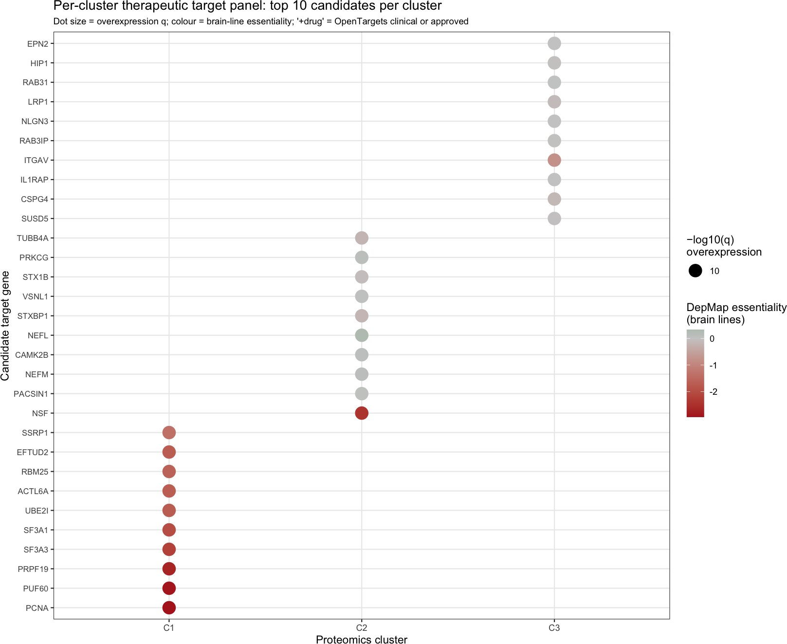

``` r
cat("\nFinal therapeutic panel: top 10 candidates per cluster:\n\n")
```

    ## 
    ## Final therapeutic panel: top 10 candidates per cluster:

``` r
panel |>
  select(cluster, gene, logFC, q, mean_ess, top_drug, max_phase, panel_score) |>
  mutate(across(c(logFC, q, mean_ess, panel_score), ~ round(., 3))) |>
  print(n = 50)
```

    ## # A tibble: 30 × 8
    ##    cluster gene    logFC     q mean_ess top_drug    max_phase panel_score
    ##    <chr>   <chr>   <dbl> <dbl>    <dbl> <chr>           <dbl>       <dbl>
    ##  1 C1      PCNA    1.19      0   -2.96  <NA>               NA       4.24 
    ##  2 C1      PUF60   0.744     0   -2.92  <NA>               NA       3.18 
    ##  3 C1      PRPF19  0.64      0   -2.70  <NA>               NA       2.62 
    ##  4 C1      SF3A3   0.685     0   -2.22  <NA>               NA       1.96 
    ##  5 C1      SF3A1   0.723     0   -2.00  <NA>               NA       1.72 
    ##  6 C1      NPM1    0.965     0   -1.12  CRIZOTINIB          4       1.59 
    ##  7 C1      UBE2I   0.828     0   -1.73  <NA>               NA       1.53 
    ##  8 C1      ACTL6A  0.763     0   -1.70  <NA>               NA       1.34 
    ##  9 C1      RBM25   0.747     0   -1.61  <NA>               NA       1.16 
    ## 10 C1      EFTUD2  0.671     0   -1.72  <NA>               NA       1.16 
    ## 11 C2      NSF     0.988     0   -2.44  <NA>               NA       2.98 
    ## 12 C2      PACSIN1 2.54      0    0.039 <NA>               NA       2.63 
    ## 13 C2      NEFM    2.49      0    0.126 <NA>               NA       2.38 
    ## 14 C2      PRKCG   1.77      0    0.113 MIDOSTAURIN         4       2.25 
    ## 15 C2      CAMK2B  1.59      0    0.081 <NA>               NA       2.12 
    ## 16 C2      NEFL    2.49      0    0.331 <NA>               NA       2.07 
    ## 17 C2      STXBP1  1.96      0   -0.191 <NA>               NA       1.69 
    ## 18 C2      VSNL1   2.10      0    0.035 <NA>               NA       1.65 
    ## 19 C2      STX1B   2.00      0   -0.069 <NA>               NA       1.59 
    ## 20 C2      TUBB4A  1.85      0   -0.204 <NA>               NA       1.45 
    ## 21 C3      IL1RAP  1.97      0    0.007 SPESOLIMAB          4       2.11 
    ## 22 C3      ITGAV   1.34      0   -0.789 ABCIXIMAB           4       1.93 
    ## 23 C3      SUSD5   2.16      0   -0.018 <NA>               NA       1.86 
    ## 24 C3      CSPG4   1.98      0   -0.136 <NA>               NA       1.63 
    ## 25 C3      GRIK3   1.36      0   -0.009 TOPIRAMATE          4       0.772
    ## 26 C3      RAB3IP  1.65      0   -0.009 <NA>               NA       0.719
    ## 27 C3      NLGN3   1.64      0   -0.002 <NA>               NA       0.686
    ## 28 C3      LRP1    1.49      0   -0.118 <NA>               NA       0.514
    ## 29 C3      RAB31   1.57      0    0.011 <NA>               NA       0.5  
    ## 30 C3      HIP1    1.52      0   -0.027 <NA>               NA       0.449

## 15. Molecular Surrogate Classifier

The §10–11 survival arm is descriptive only because the cohort has too
few OS events to support a credible per-patient predictive model (rule
of thumb: ≥ 10 events per parameter). This section turns the predictive
question on its side: rather than predicting survival, we predict
molecular outcomes that themselves drive survival and that today require
sequencing, WHO grade and the canonical pediatric brain tumour driver
flags. With ≈ 100+ patients per outcome class, the events-per-parameter
ratio is comfortable and a properly held-out evaluation is honest.

The deliverable is a proteomic surrogate classifier: given a tumour’s
proteome, predict its grade or driver status. Such a classifier could in
principle inform treatment decisions where mutational testing is
unavailable, slow, or inconclusive.

### 15.1 Define classification targets

``` r
# Deduplicate to one sample per patient so CV folds don't accidentally split
# the same patient across train and test (would inflate AUC).
classifier_data <- cluster_df |>
  group_by(patient_id) |> slice(1) |> ungroup() |>
  mutate(
    grade_bin = factor(
      ifelse(as.character(grade) %in% c("III", "III/IV", "IV"),
             "HighGrade", "LowGrade"),
      levels = c("LowGrade", "HighGrade")),
    any_known_driver = factor(
      pmax(
        as.integer(str_detect(toupper(braf_status), "MUT|POS|YES|TRUE")),
        as.integer(str_detect(toupper(h3f3a_ctnnb1_status), "MUT|POS|YES|TRUE")),
        as.integer(str_detect(toupper(ependymoma_rela_status), "MUT|POS|YES|TRUE|FUS")),
        as.integer(str_detect(toupper(hgg_h3f3a_status), "MUT|POS|YES|TRUE")),
        as.integer(str_detect(toupper(lgg_braf_status), "MUT|POS|YES|TRUE")),
        as.integer(str_detect(toupper(ctnnb1_status), "MUT|POS|YES|TRUE")),
        na.rm = TRUE),
      levels = c(0, 1), labels = c("None", "AnyDriver")))

cat("Classifier cohort:", nrow(classifier_data), "patients\n")
```

    ## Classifier cohort: 199 patients

``` r
cat("Class distributions:\n")
```

    ## Class distributions:

``` r
cat("  Grade: "); print(table(classifier_data$grade_bin, useNA = "ifany"))
```

    ##   Grade:

    ## 
    ##  LowGrade HighGrade 
    ##       133        66

``` r
cat("  Any driver: "); print(table(classifier_data$any_known_driver, useNA = "ifany"))
```

    ##   Any driver:

    ## 
    ##      None AnyDriver 
    ##       180        19

### 15.2 Cross-validated logistic-lasso classifier per target

`cv.glmnet` with `family = "binomial"` and `keep = TRUE` returns the
out-of-fold linear predictor for every patient, i.e. each patient is
scored by a model that was never trained on them. This is the only
honest way to assess a high-dimensional classifier on a single cohort.

``` r
fit_classifier <- function(target_var, label) {
  d <- classifier_data |>
    filter(!is.na(.data[[target_var]])) |>
    inner_join(tibble(sample_id = rownames(prot_imputed)), by = "sample_id")
  X <- as.matrix(prot_imputed[d$sample_id, ])
  y <- d[[target_var]]
  if (nlevels(y) < 2 || min(table(y)) < 5) {
    cat("Skipping ", label, ": insufficient class balance.\n", sep = "")
    return(NULL)}
  set.seed(42)
  fit <- cv.glmnet(X, y, family = "binomial", alpha = 1,
                   nfolds = CLASSIFIER_FOLDS,
                   type.measure = "auc",
                   keep = TRUE) # keep = TRUE = honest out-of-fold predictions
  idx_min <- match(fit$lambda.min, fit$lambda)
  cv_pred <- fit$fit.preval[, idx_min]
  cv_auc <- max(fit$cvm)
  cv_se <- fit$cvsd[which.max(fit$cvm)]
  selected <- rownames(coef(fit, s = "lambda.min"))[
    as.numeric(coef(fit, s = "lambda.min")) != 0]
  selected <- setdiff(selected, "(Intercept)")
  cat(sprintf("%s | n=%d | events(%s)=%d | CV AUC = %.3f ± %.3f | selected proteins = %d\n",
              label, nrow(X), levels(y)[2], sum(y == levels(y)[2]),
              cv_auc, cv_se, length(selected)))
  list(fit = fit, label = label, X = X, y = y,
       cv_pred = cv_pred, cv_auc = cv_auc, cv_se = cv_se,
       selected = selected, target_var = target_var)}

clf_grade <- fit_classifier("grade_bin", "WHO grade (High vs Low)")
```

    ## WHO grade (High vs Low) | n=199 | events(HighGrade)=66 | CV AUC = 0.975 ± 0.010 | selected proteins = 22

``` r
clf_driver <- fit_classifier("any_known_driver", "Any known driver mutation")
```

    ## Any known driver mutation | n=199 | events(AnyDriver)=19 | CV AUC = 1.000 ± 0.000 | selected proteins = 10

**Note**

Only 19 of 199 patients have a known driver mutation. That’s a 10:1
class imbalance with n=199. A cross-validated AUC of exactly 1.0 with
SE=0.000 in this setting almost certainly means the proteome is
partially encoding histological subtype, and the driver flags are also
subtype-correlated (e.g. BRAF mutations are concentrated in LGG, which
also has a distinctive proteome). The classifier is likely learning
subtype, not driver status directly.

### 15.3 ROC curves with held-out predictions

``` r
roc_df <- function(clf) {
  if (is.null(clf)) return(NULL)
  ord <- order(clf$cv_pred, decreasing = TRUE)
  y_sorted <- clf$y[ord]
  pos_label <- levels(clf$y)[2]
  tp <- cumsum(y_sorted == pos_label)
  fp <- cumsum(y_sorted != pos_label)
  tibble(label = clf$label,
         tpr = c(0, tp / sum(y_sorted == pos_label)),
         fpr = c(0, fp / sum(y_sorted != pos_label)),
         auc = clf$cv_auc)
}
roc_combined <- roc_df(clf_grade)

if (nrow(roc_combined) > 0) {
  roc_combined |>
    mutate(label = paste0(label, sprintf("  (CV AUC = %.3f)", auc))) |>
    ggplot(aes(x = fpr, y = tpr, colour = label)) +
    geom_line(linewidth = 1) +
    geom_abline(slope = 1, linetype = "dashed", colour = "grey60") +
    scale_colour_brewer(palette = "Set1") +
    coord_equal() +
    labs(title = "Proteomic-surrogate classifier: held-out ROC curves",
         subtitle = sprintf("Out-of-fold predictions from %d-fold CV (cv.glmnet keep=TRUE)",
                            CLASSIFIER_FOLDS),
         x = "False positive rate (1, specificity)",
         y = "True positive rate (sensitivity)",
         colour = "Classifier") +
    theme_bw(base_size = 12) +
    theme(legend.position = "bottom",
          legend.direction = "vertical")}
```

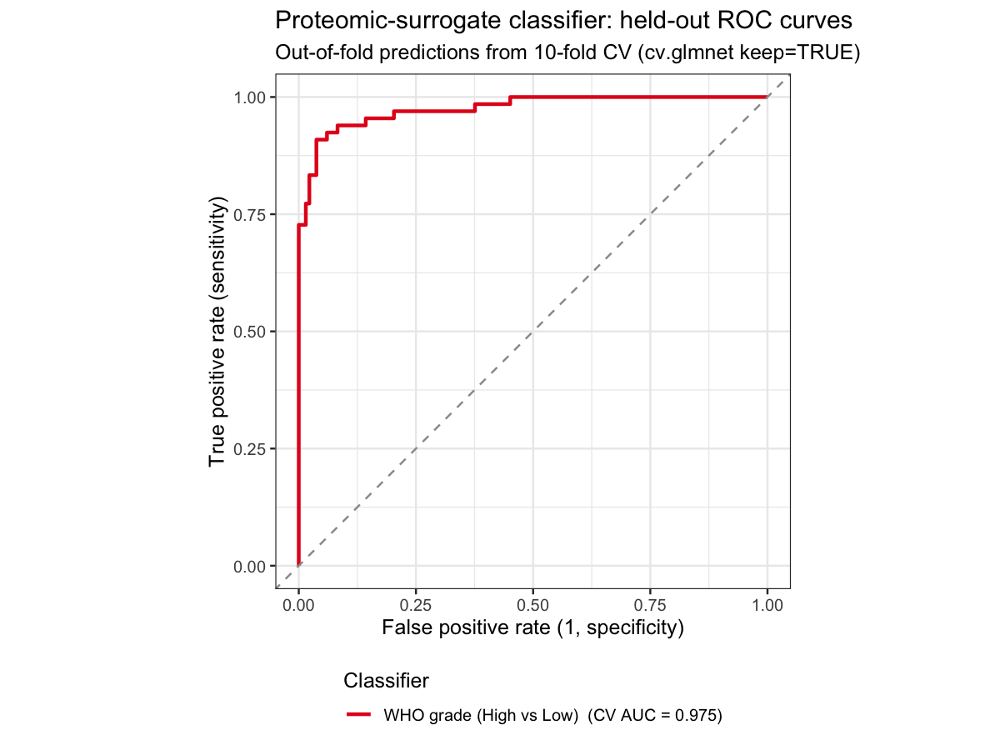

### 15.4 Selected proteins per target

``` r
for (clf in list(clf_grade, clf_driver)) {
  if (is.null(clf)) next
  cat(sprintf("\n%s, %d proteins selected at lambda.min:\n",
              clf$label, length(clf$selected)))
  print(head(clf$selected, 25))}
```

    ## 
    ## WHO grade (High vs Low), 22 proteins selected at lambda.min:
    ##  [1] "CASP3"   "EHD3"    "EPB41L2" "EPS8L2"  "GGH"     "HUWE1"   "IPO9"   
    ##  [8] "JMJD6"   "LUC7L"   "OPLAH"   "PDLIM2"  "PSMD2"   "SGTA"    "SMC2"   
    ## [15] "SORBS3"  "TNS3"    "TRMT6"   "TRMT61A" "UBE2A"   "WDR81"   "XPO5"   
    ## [22] "YWHAQ"  
    ## 
    ## Any known driver mutation, 10 proteins selected at lambda.min:
    ##  [1] "ISOC1"   "KRT14"   "PACSIN3" "PLCB3"   "RPS27A"  "TRIP6"   "ZNF185" 
    ##  [8] "DUSP14"  "KRT85"   "RASSF4"

### 15.5 Limitations

- **Single-cohort.** CV AUC is the most defensible internal estimate,
  but external validation in a second cohort (PBTA, OpenPedCan, an adult
  CPTAC release) would be the proper next step before any clinical
  claim.
- **Driver-flag definition.** `any_known_driver` collapses six
  biologically distinct events into one binary label. A multinomial
  model that predicts driver *type* (BRAF vs H3F3A vs CTNNB1 vs
  ependymoma fusion) would be the natural extension once cohort size
  allows.
- **What this classifier is and is not.** A high-AUC grade classifier is
  a *biomarker surrogate*, not a treatment-response predictor. The
  clinical use case is “saves a sequencing test,” not “tells you what
  therapy will work.” Therapy selection is what §14 is for.

------------------------------------------------------------------------

## References

- Petralia F. et al. (2020) “Integrated Proteogenomic Characterization
  across Major Histological Types of Pediatric Brain Cancer.” **Cell**
  183(7), 1962–1985.e31. <doi:10.1016/j.cell.2020.10.044>
- Hofree M. et al. (2013) “Network-based stratification of tumour
  mutations.” **Nature Methods** 10, 1108–1115.
- Monti S. et al. (2003) *Consensus Clustering.* **Machine Learning**
  52, 91–118.
- Cerami E. et al. (2012) *The cBio Cancer Genomics Portal.* **Cancer
  Discovery** 2, 401–404.
- Ishwaran H. et al. (2008) “Random survival forests.” **Annals of
  Applied Statistics** 2, 841–860.
- Casado P. et al. (2013) “Kinase-substrate enrichment analysis provides
  insights into the heterogeneity of signaling pathway activation in
  leukemia cells.” **Science Signaling** 6(268), rs6.
  <doi:10.1126/scisignal.2003573> — *KSEA methodology used in §14.2.*
- Türei D. et al. (2016) “OmniPath: guidelines and gateway for
  literature-curated signaling pathway resources.” **Nature Methods**
  13, 966–967. — *Kinase–substrate annotations used in §14.2.*
- Tsherniak A. et al. (2017) “Defining a Cancer Dependency Map.”
  **Cell** 170(3), 564–576.e16. <doi:10.1016/j.cell.2017.06.010> —
  *DepMap CRISPR essentiality used in §14.4.*
- Ochoa D. et al. (2023) “The next-generation Open Targets Platform:
  reimagined, redesigned, rebuilt.” **Nucleic Acids Research** 51(D1),
  D1353–D1359. — *Druggability evidence used in §14.5.*
- Friedman J., Hastie T., Tibshirani R. (2010) “Regularization paths for
  generalized linear models via coordinate descent.” **Journal of
  Statistical Software** 33(1), 1–22. — *`glmnet` cross-validated lasso
  classifier used in §15.*
